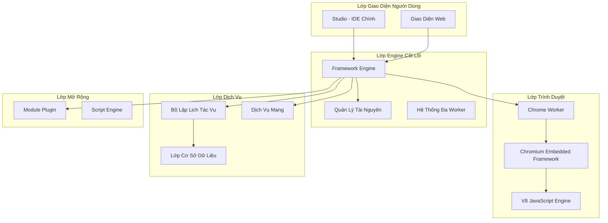

# Kiến Trúc BrowserAutomationStudio

Tài liệu này cung cấp tổng quan toàn diện về kiến trúc BrowserAutomationStudio, bao gồm thiết kế hệ thống, mối quan hệ giữa các thành phần và các mẫu thiết kế chính.

## 📋 Mục Lục

- [Tổng Quan Hệ Thống](#tổng-quan-hệ-thống)
- [Các Thành Phần Cốt Lõi](#các-thành-phần-cốt-lõi)
- [Mẫu Thiết Kế](#mẫu-thiết-kế)
- [Ngăn Xếp Công Nghệ](#ngăn-xếp-công-nghệ)
- [Tương Tác Giữa Các Thành Phần](#tương-tác-giữa-các-thành-phần)
- [Luồng Dữ Liệu](#luồng-dữ-liệu)

## 🏗️ Tổng Quan Hệ Thống

BrowserAutomationStudio tuân theo **kiến trúc đa tiến trình, modular** được thiết kế cho khả năng mở rộng, bảo trì và tính mở rộng. Hệ thống được xây dựng xung quanh một số nguyên tắc cốt lõi:

- **Tách Biệt Mối Quan Tâm**: Mỗi thành phần có một trách nhiệm cụ thể
- **Khớp Nối Lỏng Lẻo**: Các thành phần tương tác thông qua các interface được định nghĩa rõ ràng
- **Dependency Injection**: Sử dụng rộng rãi mẫu DI để có tính linh hoạt
- **Kiến Trúc Plugin**: Hệ thống modular để mở rộng chức năng

### Kiến Trúc Cấp Cao



## 🔧 Các Thành Phần Cốt Lõi

### 1. Thành Phần Studio
**Vị Trí**: `Solution/Studio/`
**Mục Đích**: IDE chính và giao diện quản lý dự án

**Các Class Chính**:
- `MainWindow`: Cửa sổ ứng dụng chính và điều phối viên
- `Compiler`: Biên dịch và xác thực script
- `ModuleManager`: Giao diện quản lý plugin
- `DatabaseAdmin`: Công cụ quản trị cơ sở dữ liệu

**Trách Nhiệm**:
- Tạo và quản lý dự án
- Chỉnh sửa và xác thực script
- Cài đặt và cấu hình module
- Quản trị cơ sở dữ liệu
- Giao diện người dùng cho thiết kế tự động hóa

### 2. Thành Phần Engine
**Vị Trí**: `Solution/Engine/`
**Mục Đích**: Framework tự động hóa cốt lõi và runtime

**Các Interface Chính**:
- `IMultiWorker`: Interface thực thi đa luồng
- `IBrowser`: Lớp trừu tượng trình duyệt
- `IResourceController`: Interface quản lý tài nguyên
- `IModuleManager`: Interface hệ thống module

**Các Class Chính**:
- `ScriptMultiWorker`: Thực thi script đa luồng
- `Resources`: Hệ thống quản lý tài nguyên
- `ModuleManager`: Quản lý hệ thống plugin
- `DatabaseState`: Quản lý kết nối cơ sở dữ liệu

**Trách Nhiệm**:
- Engine thực thi script
- Quản lý tài nguyên (chuỗi, file, cơ sở dữ liệu)
- Quản lý đa luồng và worker
- Điều phối hệ thống plugin
- Factory và quản lý trình duyệt

### 3. ChromeWorker Component
**Location**: `Solution/ChromeWorker/`
**Purpose**: Browser automation agent using CEF

**Key Classes**:
- `MainApp`: CEF application entry point
- `MainHandler`: Browser event handling
- `V8Handler`: JavaScript bridge implementation
- `BrowserData`: Browser state management
- `ElementCommand`: DOM element interaction

**Responsibilities**:
- Browser process management
- DOM manipulation and interaction
- JavaScript execution in browser context
- Event handling and automation
- DevTools integration

### 4. Scheduler Component
**Location**: `Solution/Scheduler/`
**Purpose**: Task scheduling and execution management

**Key Classes**:
- `TaskManager`: Task lifecycle management
- `RunManager`: Execution coordination
- `SchedulerInstaller`: System service installation
- `WebApplication`: HTTP API interface

**Responsibilities**:
- Task scheduling and queuing
- Execution monitoring and control
- System service integration
- REST API for remote management

## 🎨 Design Patterns

### 1. Factory Pattern
Extensively used for creating browser instances, workers, and resources:

```cpp
// Browser Factory Pattern
class IBrowserFactory {
public:
    virtual IBrowser* CreateBrowser() = 0;
    virtual void ReleaseBrowser(IBrowser* browser) = 0;
};

class SubprocessBrowserFactory : public IBrowserFactory {
    // Implementation for subprocess-based browsers
};
```

### 2. Observer Pattern
Used for event handling and state notifications:

```cpp
// Resource change notifications
class IResourceWatcher {
public:
    virtual void OnResourceChanged(const QString& resourceId) = 0;
};
```

### 3. Strategy Pattern
Used for different execution strategies and algorithms:

```cpp
// Post preparation strategies
class IPostPrepareStrategy {
public:
    virtual QString PreparePost(const QString& data) = 0;
};

class PostPrepareStrategyUrlEncode : public IPostPrepareStrategy {
    // URL encoding implementation
};

class PostPrepareStrategyMultipart : public IPostPrepareStrategy {
    // Multipart encoding implementation
};
```

### 4. Dependency Injection
Pervasive use of DI for loose coupling:

```cpp
class ScriptMultiWorker : public IMultiWorker {
private:
    IBrowserFactory* BrowserFactory;
    ILogger* Logger;
    IResourceController* ResourceController;
    
public:
    ScriptMultiWorker(IBrowserFactory* browserFactory,
                     ILogger* logger,
                     IResourceController* resourceController);
};
```

### 5. Command Pattern
Used for browser automation commands:

```cpp
class ElementCommand {
public:
    QString Command;
    QString Selector;
    QString Value;
    // Command execution logic
};
```

## 💻 Technology Stack

### Backend Technologies
- **C++17**: Core application language
- **Qt 5.x**: Cross-platform application framework
- **CEF (Chromium Embedded Framework)**: Browser integration
- **V8**: JavaScript engine integration
- **SQLite/MongoDB**: Database support
- **libcurl**: HTTP client functionality
- **Snappy**: Data compression

### Frontend Technologies
- **HTML5/CSS3**: User interface markup and styling
- **JavaScript ES6+**: Client-side scripting
- **Backbone.js**: MVC framework for scenario editor
- **Bootstrap**: UI component framework
- **jQuery**: DOM manipulation and utilities
- **Vue.js**: Component-based UI (scheduler interface)

### Build System
- **qmake**: Qt-based build system
- **Visual Studio**: Windows compilation
- **Git**: Version control

## 🔄 Component Interactions

### 1. Studio ↔ Engine Interaction
```cpp
// Studio creates and configures engine components
Engine* engine = new Engine();
Resources* resources = new Resources();
ScriptMultiWorker* worker = new ScriptMultiWorker(
    browserFactory, logger, resourceController
);
```

### 2. Engine ↔ ChromeWorker Communication
- **IPC (Inter-Process Communication)**: Named pipes and shared memory
- **JSON Messages**: Structured command/response protocol
- **Event Callbacks**: Asynchronous event handling

### 3. Module System Integration
```cpp
// Module loading and integration
class ModuleManager {
public:
    void LoadModule(const QString& modulePath);
    void RegisterModuleActions(IModule* module);
    QList<IAction*> GetAvailableActions();
};
```

## 📊 Data Flow

### Script Execution Flow
1. **Studio** → Compiles and validates script
2. **Engine** → Creates worker instances and resources
3. **ChromeWorker** → Executes browser automation commands
4. **Modules** → Process data and perform specialized tasks
5. **Resources** → Store and retrieve execution data
6. **Results** → Return processed data to calling components

### Resource Management Flow
1. **Resource Definition** → Studio defines resource types and sources
2. **Resource Loading** → Engine loads and caches resources
3. **Resource Distribution** → Workers access resources through controllers
4. **Resource Updates** → Changes propagated through observer pattern

## 🔧 Configuration and Extensibility

### Module System
- **JSON Manifests**: Define module capabilities and interfaces
- **JavaScript Actions**: Implement automation logic
- **C++ Extensions**: Native code integration for performance
- **Dynamic Loading**: Runtime module discovery and loading

### Interface Abstractions
The system uses extensive interface abstractions to enable:
- **Testing**: Mock implementations for unit testing
- **Flexibility**: Multiple implementations of core services
- **Extensibility**: Easy addition of new functionality
- **Maintainability**: Clear separation of concerns

---

*For detailed implementation examples, see the [Component Guide](../Components/README.md)*
