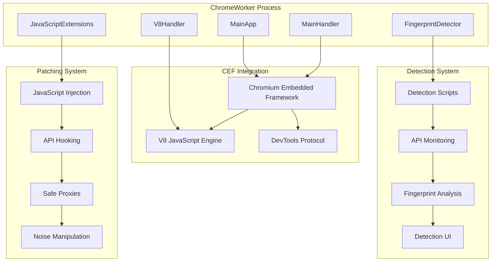

# Phân Tích Chi Tiết ChromeWorker: Kỹ Thuật Patch Fingerprint và Detection

Tài liệu này cung cấp phân tích sâu về thư mục ChromeWorker, tập trung vào các kỹ thuật patch fingerprint và detection mechanism mà BrowserAutomationStudio sử dụng để chống lại việc thu thập thông tin từ phía người dùng.

## 📋 Mục Lục

- [Tổng Quan ChromeWorker](#tổng-quan-chromeworker)
- [Kiến Trúc Fingerprint Patching](#kiến-trúc-fingerprint-patching)
- [FingerprintDetector System](#fingerprintdetector-system)
- [JavaScript Injection Framework](#javascript-injection-framework)
- [Browser API Hooking](#browser-api-hooking)
- [Detection Mechanisms](#detection-mechanisms)
- [Anti-Detection Techniques](#anti-detection-techniques)

## 🏗️ Tổng Quan ChromeWorker

### Cấu Trúc Thư Mục ChromeWorker

```
ChromeWorker/
├── fingerprintdetector.cpp/.h     # Core fingerprint detection engine
├── javascriptextensions.cpp/.h    # JavaScript injection framework
├── mainapp.cpp/.h                 # Main application orchestrator
├── mainhandler.cpp/.h             # CEF request/response handler
├── v8handler.cpp/.h               # V8 JavaScript engine handler
├── html/
│   ├── detector/                  # Fingerprint detection UI
│   │   ├── index.html            # Main detector interface
│   │   ├── js/fingerprintdata.js # Detection data processing
│   │   └── components/           # Vue.js components
│   ├── main/                     # Core JavaScript libraries
│   │   ├── generate_safe_data.js # Safe API wrappers
│   │   └── xpath_path.js         # DOM manipulation
│   └── scenario/                 # Script execution interface
└── connector/                    # DevTools protocol integration
```

### Core Architecture



## 🔍 FingerprintDetector System

### Core Detection Engine

<augment_code_snippet path="Solution/ChromeWorker/fingerprintdetector.cpp" mode="EXCERPT">
````cpp
int FingerprintDetector::Timer(CefRefPtr<CefBrowser> DetectorBrowser, bool Initialized) {
    int Res = 0;
    if(!IsInitialized)
        return Res;

    time_t now = time(0);
    if(LastTimer != 0 && now - LastTimer < 5)
        return Res;

    LastTimer = now;

    std::string ToSend;
    std::string MutexName = std::string("FINGERPRINTDETECTOR_") + UniqueId;
    HANDLE MutexHandler = CreateMutexA(0,false,MutexName.c_str());
    WaitForSingleObject(MutexHandler,INFINITE);

    std::vector<std::string> Data = DataPending;
    DataPending.clear();

    try{
        std::string Filename = std::string("s/") + UniqueId + std::string(".detect");
        std::ifstream Detect(Filename);
        std::string Line;
        while(std::getline(Detect, Line)) {
            int Level = 0;
            if(!Line.empty()) {
                Level = std::stoi(Line.substr(0,1));
                Line.erase(0,1);
            }

            Data.push_back(Line);
            LastGroupCount++;

            if(Level >= 5)
                Res += 1;  // High-risk detection
        }
        Detect.close();
        remove(Filename.c_str());
    }catch(...) {}
````
</augment_code_snippet>

### Detection Data Processing

<augment_code_snippet path="Solution/ChromeWorker/html/detector/js/fingerprintdata.js" mode="EXCERPT">
````javascript
class FingerprintDataClass {
    constructor(OnData) {
        this.DataPending = [];
        this.Key = "";
        this.OnData = OnData
        this.LastSent = 0
        var self = this
        setInterval(function(){
            self.AddData("")
        },1000)
    }

    AddData(NewDataString) {
        var NewDataList = NewDataString.split(",")
        if(NewDataString.length > 0)
            this.DataPending = this.DataPending.concat(NewDataList)
        let now = Date.now()
        if(!this.Key || (this.LastSent != 0 && now - this.LastSent < 5000) || this.DataPending.length == 0) {
            return
        }

        this.LastSent = now;
        let SendData = {
            headers: {
                'Accept': 'application/json',
                'Content-Type': 'application/json'
            },
            method: "POST",
            body: JSON.stringify(this.DataPending.slice(0,500))
        }
        this.DataPending = this.DataPending.slice(500)
        let self = this

        fetch(`https://fingerprints.bablosoft.com/detector/decrypt?key=${this.Key}`, SendData)
          .then(function(response) {
            return response.json()
          }).then(function(json) {
            if(json["valid"])
                self.OnData(json["data"].map(function(x){
                    var res = JSON.parse(x); 
                    res["type"] = "fingerprint"; 
                    return res
                }))
          })
    }
}
````
</augment_code_snippet>

### Detection Categories

Hệ thống phát hiện các loại fingerprinting sau:

#### **1. Canvas Fingerprinting**
```javascript
// Detected when websites access canvas data
{
    "id": "Canvas",
    "method": "toDataURL",
    "level": 5,  // High risk
    "timestamp": 1640995200000,
    "stack": "at HTMLCanvasElement.toDataURL...",
    "params": {
        "width": 200,
        "height": 50,
        "type": "image/png"
    }
}
```

#### **2. WebGL Fingerprinting**
```javascript
// Detected when websites query WebGL properties
{
    "id": "WebGL",
    "method": "getParameter",
    "level": 4,
    "params": {
        "parameter": "RENDERER",
        "value": "ANGLE (Intel(R) HD Graphics 620 Direct3D11 vs_5_0 ps_5_0)"
    }
}
```

#### **3. Audio Fingerprinting**
```javascript
// Detected when websites analyze audio context
{
    "id": "Audio",
    "method": "createAnalyser",
    "level": 3,
    "params": {
        "sampleRate": 44100,
        "channelCount": 2
    }
}
```

#### **4. Font Fingerprinting**
```javascript
// Detected when websites enumerate fonts
{
    "id": "Font",
    "method": "measureText",
    "level": 2,
    "params": {
        "font": "Arial",
        "text": "mmmmmmmmmmlli",
        "width": 123.456
    }
}
```

#### **5. Screen/Hardware Fingerprinting**
```javascript
// Detected when websites access screen properties
{
    "id": "Screen",
    "method": "screen.width",
    "level": 1,
    "params": {
        "width": 1920,
        "height": 1080,
        "colorDepth": 24,
        "pixelDepth": 24
    }
}
```

## 💉 JavaScript Injection Framework

### Core Injection System

<augment_code_snippet path="Solution/ChromeWorker/javascriptextensions.cpp" mode="EXCERPT">
````cpp
std::string JavaScriptExtensions::GetBasicExtension(bool IsRecord) {
    std::string additional;

    if(IsRecord) {
        additional += ReadAllString(GetRelativePathToExe(std::wstring(L"html/main/css_path.js")));
        additional += ReadAllString(GetRelativePathToExe(std::wstring(L"html/main/xpath_path.js")));
        additional += ReadAllString(GetRelativePathToExe(std::wstring(L"html/main/diff_match.js")));
        additional += ReadAllString(GetRelativePathToExe(std::wstring(L"html/main/multiselect.js")));
    }

    std::string original_functions = ReadAllString(GetRelativePathToExe(std::wstring(L"html/main/generate_safe_data.js")));

    return
    original_functions +
    additional +
    inspect_script
     + std::string(
    "_BAS_HIDE(BrowserAutomationStudio_Evaluate) = function (expression, element) {"
        "return _BAS_SAFE($Document.evaluate)(expression, element, null, 7, null);"
    "};"
    "_BAS_HIDE(BrowserAutomationStudio_ToString) = function (value) {"
        "if (typeof value === 'symbol') {"
            "return _BAS_SAFE($Symbol.toString)(value);"
        "}"
        "return value == null ? value.toString() : '' + value;"
    "};"
    "_BAS_HIDE(BrowserAutomationStudio_GetPageContent) = function () {"
        "return _BAS_SAFE($Node.outerHTML)(_BAS_SAFE($Document.documentElement)(document));"
    "};"
    );
}
````
</augment_code_snippet>

### Safe API Wrapper System

```javascript
// Generate Safe Data Framework
(function() {
    // Create safe references to original APIs before they can be modified
    window._BAS_SAFE = function(original) {
        return original;
    };
    
    // Store original functions
    window._BAS_SAFE.$Document = {
        evaluate: Document.prototype.evaluate,
        querySelector: Document.prototype.querySelector,
        querySelectorAll: Document.prototype.querySelectorAll,
        getElementById: Document.prototype.getElementById,
        getElementsByClassName: Document.prototype.getElementsByClassName,
        getElementsByTagName: Document.prototype.getElementsByTagName
    };
    
    window._BAS_SAFE.$Element = {
        click: HTMLElement.prototype.click,
        focus: HTMLElement.prototype.focus,
        blur: HTMLElement.prototype.blur,
        scrollIntoView: HTMLElement.prototype.scrollIntoView
    };
    
    window._BAS_SAFE.$Canvas = {
        getContext: HTMLCanvasElement.prototype.getContext,
        toDataURL: HTMLCanvasElement.prototype.toDataURL,
        toBlob: HTMLCanvasElement.prototype.toBlob
    };
    
    window._BAS_SAFE.$WebGL = {
        getParameter: WebGLRenderingContext.prototype.getParameter,
        getExtension: WebGLRenderingContext.prototype.getExtension,
        getSupportedExtensions: WebGLRenderingContext.prototype.getSupportedExtensions
    };
    
    window._BAS_SAFE.$Audio = {
        createAnalyser: AudioContext.prototype.createAnalyser,
        createOscillator: AudioContext.prototype.createOscillator,
        createGain: AudioContext.prototype.createGain
    };
})();
```

### Hide Extension System

<augment_code_snippet path="Solution/ChromeWorker/javascriptextensions.cpp" mode="EXCERPT">
````cpp
std::string JavaScriptExtensions::GetHideExtension(const std::string& UniqueProcessId) {
    return std::string("Object.defineProperty(location.reload, '_bas_hide_") + UniqueProcessId + std::string("', { value: {} });");
}
````
</augment_code_snippet>

## 🎯 Browser API Hooking

### Canvas API Patching

```javascript
// Canvas Noise Injection
(function() {
    const originalToDataURL = HTMLCanvasElement.prototype.toDataURL;
    const originalGetImageData = CanvasRenderingContext2D.prototype.getImageData;
    
    HTMLCanvasElement.prototype.toDataURL = function(...args) {
        // Apply noise before extracting data
        if (window.FINGERPRINT_CANVAS && window.FINGERPRINT_JSON) {
            const ctx = this.getContext('2d');
            const imageData = ctx.getImageData(0, 0, this.width, this.height);
            const data = imageData.data;
            
            // Apply noise pattern
            const noise = window.FINGERPRINT_JSON.canvas;
            for (let i = 0; i < data.length; i += 4) {
                if (noise[i % noise.length]) {
                    data[i] = Math.min(255, data[i] + noise[i % noise.length]);     // R
                    data[i+1] = Math.min(255, data[i+1] + noise[(i+1) % noise.length]); // G
                    data[i+2] = Math.min(255, data[i+2] + noise[(i+2) % noise.length]); // B
                }
            }
            
            ctx.putImageData(imageData, 0, 0);
        }
        
        return originalToDataURL.apply(this, args);
    };
    
    CanvasRenderingContext2D.prototype.getImageData = function(...args) {
        const result = originalGetImageData.apply(this, args);
        
        // Apply noise to image data
        if (window.FINGERPRINT_CANVAS && window.FINGERPRINT_JSON) {
            const noise = window.FINGERPRINT_JSON.canvas;
            const data = result.data;
            
            for (let i = 0; i < data.length; i += 4) {
                if (noise[i % noise.length]) {
                    data[i] = Math.min(255, data[i] + noise[i % noise.length]);
                    data[i+1] = Math.min(255, data[i+1] + noise[(i+1) % noise.length]);
                    data[i+2] = Math.min(255, data[i+2] + noise[(i+2) % noise.length]);
                }
            }
        }
        
        return result;
    };
})();
```

### WebGL API Spoofing

```javascript
// WebGL Properties Spoofing
(function() {
    const originalGetParameter = WebGLRenderingContext.prototype.getParameter;
    const originalGetExtension = WebGLRenderingContext.prototype.getExtension;
    
    WebGLRenderingContext.prototype.getParameter = function(parameter) {
        if (window.FINGERPRINT_WEBGL && window.FINGERPRINT_JSON) {
            const spoofedValues = window.FINGERPRINT_JSON.webgl_properties;
            
            switch(parameter) {
                case this.VENDOR:
                    return spoofedValues.vendor || "Google Inc.";
                case this.RENDERER:
                    return spoofedValues.renderer || "ANGLE (Intel(R) HD Graphics 620 Direct3D11 vs_5_0 ps_5_0)";
                case this.VERSION:
                    return spoofedValues.version || "WebGL 1.0 (OpenGL ES 2.0 Chromium)";
                case this.SHADING_LANGUAGE_VERSION:
                    return spoofedValues.shading_language_version || "WebGL GLSL ES 1.0 (OpenGL ES GLSL ES 1.0 Chromium)";
                case this.MAX_TEXTURE_SIZE:
                    return spoofedValues.max_texture_size || 16384;
                case this.MAX_VIEWPORT_DIMS:
                    return new Int32Array(spoofedValues.max_viewport_dims || [16384, 16384]);
            }
        }
        
        return originalGetParameter.apply(this, arguments);
    };
    
    WebGLRenderingContext.prototype.getExtension = function(name) {
        if (window.FINGERPRINT_WEBGL && window.FINGERPRINT_JSON) {
            const allowedExtensions = window.FINGERPRINT_JSON.webgl_extensions || [];
            if (!allowedExtensions.includes(name)) {
                return null;  // Hide extension
            }
        }
        
        return originalGetExtension.apply(this, arguments);
    };
})();
```

### Audio API Patching

```javascript
// Audio Context Fingerprinting Protection
(function() {
    const originalCreateAnalyser = AudioContext.prototype.createAnalyser;
    const originalCreateOscillator = AudioContext.prototype.createOscillator;
    const originalGetFloatFrequencyData = AnalyserNode.prototype.getFloatFrequencyData;

    AudioContext.prototype.createAnalyser = function() {
        const analyser = originalCreateAnalyser.apply(this, arguments);

        // Override getFloatFrequencyData to add noise
        const originalGetFloatFreq = analyser.getFloatFrequencyData;
        analyser.getFloatFrequencyData = function(array) {
            originalGetFloatFreq.apply(this, arguments);

            if (window.FINGERPRINT_AUDIO && window.FINGERPRINT_JSON) {
                const noise = window.FINGERPRINT_JSON.audio;
                for (let i = 0; i < array.length; i++) {
                    array[i] += (noise[i % noise.length] || 0) * 0.0001;
                }
            }
        };

        return analyser;
    };

    AudioContext.prototype.createOscillator = function() {
        const oscillator = originalCreateOscillator.apply(this, arguments);

        // Add slight frequency deviation
        if (window.FINGERPRINT_AUDIO && window.FINGERPRINT_JSON) {
            const originalStart = oscillator.start;
            oscillator.start = function(when) {
                // Add small random deviation to frequency
                if (this.frequency) {
                    const deviation = (window.FINGERPRINT_JSON.audio_deviation || 0) * 0.001;
                    this.frequency.value += deviation;
                }
                return originalStart.apply(this, arguments);
            };
        }

        return oscillator;
    };
})();
```

### Navigator Object Spoofing

```javascript
// Navigator Properties Spoofing
(function() {
    if (window.FINGERPRINT_JSON && window.FINGERPRINT_JSON.navigator) {
        const spoofedNav = window.FINGERPRINT_JSON.navigator;

        // Spoof hardware concurrency
        if (spoofedNav.hardwareConcurrency) {
            Object.defineProperty(navigator, 'hardwareConcurrency', {
                get: function() { return spoofedNav.hardwareConcurrency; },
                configurable: true
            });
        }

        // Spoof device memory
        if (spoofedNav.deviceMemory) {
            Object.defineProperty(navigator, 'deviceMemory', {
                get: function() { return spoofedNav.deviceMemory; },
                configurable: true
            });
        }

        // Spoof max touch points
        if (spoofedNav.maxTouchPoints !== undefined) {
            Object.defineProperty(navigator, 'maxTouchPoints', {
                get: function() { return spoofedNav.maxTouchPoints; },
                configurable: true
            });
        }

        // Spoof platform
        if (spoofedNav.platform) {
            Object.defineProperty(navigator, 'platform', {
                get: function() { return spoofedNav.platform; },
                configurable: true
            });
        }

        // Spoof plugins
        if (spoofedNav.plugins) {
            Object.defineProperty(navigator, 'plugins', {
                get: function() { return spoofedNav.plugins; },
                configurable: true
            });
        }
    }
})();
```

### Screen Properties Manipulation

```javascript
// Screen and Rectangle Fingerprinting Protection
(function() {
    if (window.FINGERPRINT_RECTANGLES && window.FINGERPRINT_JSON) {
        const rectangles = window.FINGERPRINT_JSON.rectangles;

        // Spoof screen properties
        Object.defineProperty(screen, 'width', {
            get: function() { return rectangles.screen_width || 1920; },
            configurable: true
        });

        Object.defineProperty(screen, 'height', {
            get: function() { return rectangles.screen_height || 1080; },
            configurable: true
        });

        Object.defineProperty(screen, 'availWidth', {
            get: function() { return rectangles.avail_width || 1920; },
            configurable: true
        });

        Object.defineProperty(screen, 'availHeight', {
            get: function() { return rectangles.avail_height || 1040; },
            configurable: true
        });

        Object.defineProperty(screen, 'colorDepth', {
            get: function() { return rectangles.color_depth || 24; },
            configurable: true
        });

        Object.defineProperty(screen, 'pixelDepth', {
            get: function() { return rectangles.pixel_depth || 24; },
            configurable: true
        });

        // Spoof window properties
        Object.defineProperty(window, 'innerWidth', {
            get: function() { return rectangles.inner_width || 1920; },
            configurable: true
        });

        Object.defineProperty(window, 'innerHeight', {
            get: function() { return rectangles.inner_height || 1080; },
            configurable: true
        });

        Object.defineProperty(window, 'outerWidth', {
            get: function() { return rectangles.outer_width || 1920; },
            configurable: true
        });

        Object.defineProperty(window, 'outerHeight', {
            get: function() { return rectangles.outer_height || 1080; },
            configurable: true
        });
    }
})();
```

## 🔍 Detection Mechanisms

### Real-time Fingerprint Monitoring

<augment_code_snippet path="Solution/ChromeWorker/html/detector/index.html" mode="EXCERPT">
````html
<script type="text/javascript">
    //Fingerprint data initialization
    FingerprintData = new FingerprintDataClass(function(Result){
        var ResWithIds = Result.map(function(x) {
            x["_id"] = Math.random().toString(36).substr(2, 9);
            return x;
        }).filter(x => {
            let res = true;
            if(x.stack && x.stack.indexOf("file:///") >= 0)
                res = false
            return res;
        })

        // Process different fingerprint types
        ResWithIds.forEach(x => {
            if(x.id == "Timezone") {
                x.params = {method: x.method}
                x.method = "Timezone"
                x.level = 2
            }

            if(x.id == "Geolocation") {
                x.params = {method: x.method}
                x.method = "Geolocation"
            }

            if(x.id == "UserMedia") {
                x.params = {method: x.method}
                x.method = "UserMedia"
            }

            if(x.id == "SVG") {
                x.params = {method: x.method}
                x.method = "SVG"
            }
        })

        ResWithIds.forEach(x => {
            x["tag"] = window.Descriptions.GetTag(x)
        })

        App.FingerprintData = App.FingerprintData.concat(ResWithIds).sort(function(x, y) {
            var res = x.timestamp - y.timestamp
            if(res == 0 && x["type"] != y["type"]) {
                if(x["type"] == "fingerprint")
                    return 1
                if(y["type"] == "fingerprint")
                    return -1
            }
            return res;
        }).splice(-5000)
    });
</script>
````
</augment_code_snippet>

### Detection Data Analysis

```javascript
// Advanced Detection Analysis
class FingerprintAnalyzer {
    constructor() {
        this.detectionPatterns = {
            canvas: {
                suspicious_methods: ['toDataURL', 'getImageData', 'toBlob'],
                risk_threshold: 3,
                time_window: 5000  // 5 seconds
            },
            webgl: {
                suspicious_methods: ['getParameter', 'getExtension', 'getSupportedExtensions'],
                risk_threshold: 5,
                time_window: 3000
            },
            audio: {
                suspicious_methods: ['createAnalyser', 'getFloatFrequencyData', 'createOscillator'],
                risk_threshold: 2,
                time_window: 10000
            },
            fonts: {
                suspicious_methods: ['measureText', 'getComputedStyle'],
                risk_threshold: 10,
                time_window: 2000
            }
        };

        this.detectionHistory = [];
        this.riskScore = 0;
    }

    analyzeDetection(detection) {
        const category = this.categorizeDetection(detection);
        const pattern = this.detectionPatterns[category];

        if (!pattern) return;

        // Add to history
        this.detectionHistory.push({
            ...detection,
            category: category,
            timestamp: Date.now()
        });

        // Clean old detections
        const cutoff = Date.now() - pattern.time_window;
        this.detectionHistory = this.detectionHistory.filter(d => d.timestamp > cutoff);

        // Calculate risk score
        const recentDetections = this.detectionHistory.filter(d =>
            d.category === category && d.timestamp > cutoff
        );

        if (recentDetections.length >= pattern.risk_threshold) {
            this.riskScore += this.calculateRiskIncrease(category, recentDetections.length);
            this.triggerAlert(category, recentDetections);
        }
    }

    categorizeDetection(detection) {
        if (detection.method && detection.method.includes('canvas')) return 'canvas';
        if (detection.method && detection.method.includes('webgl')) return 'webgl';
        if (detection.method && detection.method.includes('audio')) return 'audio';
        if (detection.method && detection.method.includes('font')) return 'fonts';
        return 'unknown';
    }

    calculateRiskIncrease(category, count) {
        const baseRisk = {
            canvas: 10,
            webgl: 8,
            audio: 5,
            fonts: 3
        };

        return (baseRisk[category] || 1) * Math.log(count);
    }

    triggerAlert(category, detections) {
        console.warn(`High-risk ${category} fingerprinting detected:`, detections);

        // Send alert to main process
        if (window.BrowserAutomationStudio_FingerprintAlert) {
            window.BrowserAutomationStudio_FingerprintAlert({
                category: category,
                count: detections.length,
                riskScore: this.riskScore,
                detections: detections
            });
        }
    }
}
```

## 🛡️ Anti-Detection Techniques

### Perfect Canvas Technology

```javascript
// Perfect Canvas Implementation
class PerfectCanvasManager {
    constructor() {
        this.apiUrl = "https://fingerprints.bablosoft.com/api";
        this.requestQueue = [];
        this.responseCache = new Map();
        this.isEnabled = false;
    }

    async requestPerfectCanvas(canvasData) {
        if (!this.isEnabled) return null;

        try {
            const response = await fetch(this.apiUrl, {
                method: 'POST',
                headers: {
                    'Content-Type': 'application/octet-stream',
                    'Accept-Encoding': 'gzip, deflate'
                },
                body: canvasData
            });

            const result = await response.json();
            if (result.Status === "success") {
                return result.Data;
            } else {
                throw new Error(result.Message);
            }
        } catch (error) {
            console.error('Perfect Canvas request failed:', error);
            return null;
        }
    }

    async getPerfectCanvasResult(requestId) {
        try {
            const response = await fetch(`${this.apiUrl}/result/${requestId}`);
            const result = await response.json();

            if (result.Status === "success") {
                return result.Data;
            } else if (result.Status === "processing") {
                // Wait and retry
                await new Promise(resolve => setTimeout(resolve, 1000));
                return this.getPerfectCanvasResult(requestId);
            } else {
                throw new Error(result.Message);
            }
        } catch (error) {
            console.error('Perfect Canvas result failed:', error);
            return null;
        }
    }

    enable() {
        this.isEnabled = true;
        this.patchCanvasAPIs();
    }

    patchCanvasAPIs() {
        const self = this;
        const originalToDataURL = HTMLCanvasElement.prototype.toDataURL;

        HTMLCanvasElement.prototype.toDataURL = async function(...args) {
            if (self.isEnabled && window.FINGERPRINT_PERFECTCANVAS) {
                try {
                    // Get original canvas data
                    const originalData = originalToDataURL.apply(this, args);

                    // Request perfect canvas from server
                    const perfectData = await self.requestPerfectCanvas(originalData);

                    if (perfectData) {
                        return perfectData;
                    }
                } catch (error) {
                    console.error('Perfect Canvas failed, using fallback:', error);
                }
            }

            return originalToDataURL.apply(this, args);
        };
    }
}
```

### Dynamic Fingerprint Switching

```javascript
// Dynamic Fingerprint Management
class DynamicFingerprintManager {
    constructor() {
        this.currentFingerprint = null;
        this.fingerprintHistory = [];
        this.switchInterval = 300000; // 5 minutes
        this.isAutoSwitchEnabled = false;
    }

    async loadFingerprint(fingerprintData) {
        this.currentFingerprint = fingerprintData;

        // Apply fingerprint immediately
        await this.applyFingerprint(fingerprintData);

        // Add to history
        this.fingerprintHistory.push({
            fingerprint: fingerprintData,
            appliedAt: Date.now(),
            source: 'manual'
        });

        // Limit history size
        if (this.fingerprintHistory.length > 10) {
            this.fingerprintHistory.shift();
        }
    }

    async applyFingerprint(fingerprintData) {
        // Apply canvas fingerprint
        if (fingerprintData.canvas) {
            window.FINGERPRINT_CANVAS = true;
            window.FINGERPRINT_JSON = window.FINGERPRINT_JSON || {};
            window.FINGERPRINT_JSON.canvas = fingerprintData.canvas;
        }

        // Apply WebGL fingerprint
        if (fingerprintData.webgl) {
            window.FINGERPRINT_WEBGL = true;
            window.FINGERPRINT_JSON.webgl_properties = fingerprintData.webgl_properties;
            window.FINGERPRINT_JSON.webgl_extensions = fingerprintData.webgl_extensions;
        }

        // Apply audio fingerprint
        if (fingerprintData.audio) {
            window.FINGERPRINT_AUDIO = true;
            window.FINGERPRINT_JSON.audio = fingerprintData.audio;
            window.FINGERPRINT_JSON.audio_deviation = fingerprintData.audio_deviation;
        }

        // Apply screen fingerprint
        if (fingerprintData.rectangles) {
            window.FINGERPRINT_RECTANGLES = true;
            window.FINGERPRINT_JSON.rectangles = fingerprintData.rectangles;
        }

        // Apply navigator fingerprint
        if (fingerprintData.navigator) {
            window.FINGERPRINT_JSON.navigator = fingerprintData.navigator;
            this.applyNavigatorSpoofing(fingerprintData.navigator);
        }

        console.log('Fingerprint applied successfully:', fingerprintData);
    }

    applyNavigatorSpoofing(navigatorData) {
        // Re-define navigator properties with new values
        for (const [key, value] of Object.entries(navigatorData)) {
            if (navigator.hasOwnProperty(key)) {
                Object.defineProperty(navigator, key, {
                    get: function() { return value; },
                    configurable: true
                });
            }
        }
    }

    enableAutoSwitch() {
        this.isAutoSwitchEnabled = true;
        this.startAutoSwitchTimer();
    }

    disableAutoSwitch() {
        this.isAutoSwitchEnabled = false;
        if (this.autoSwitchTimer) {
            clearInterval(this.autoSwitchTimer);
        }
    }

    startAutoSwitchTimer() {
        this.autoSwitchTimer = setInterval(async () => {
            if (this.isAutoSwitchEnabled) {
                await this.switchToRandomFingerprint();
            }
        }, this.switchInterval);
    }

    async switchToRandomFingerprint() {
        try {
            // Request new fingerprint from server
            const response = await fetch('https://fingerprints.bablosoft.com/api/random');
            const newFingerprint = await response.json();

            if (newFingerprint && newFingerprint.fingerprint) {
                await this.loadFingerprint(newFingerprint.fingerprint);

                this.fingerprintHistory.push({
                    fingerprint: newFingerprint.fingerprint,
                    appliedAt: Date.now(),
                    source: 'auto'
                });

                console.log('Auto-switched to new fingerprint');
            }
        } catch (error) {
            console.error('Auto fingerprint switch failed:', error);
        }
    }
}
```

## 📊 Performance Impact Analysis

### Fingerprint Patching Overhead

```cpp
class FingerprintPerformanceProfiler {
private:
    std::chrono::high_resolution_clock::time_point start_time;
    std::map<std::string, std::vector<double>> operation_times;
    std::map<std::string, int> operation_counts;

public:
    void StartTiming(const std::string& operation) {
        start_time = std::chrono::high_resolution_clock::now();
    }

    void EndTiming(const std::string& operation) {
        auto end_time = std::chrono::high_resolution_clock::now();
        auto duration = std::chrono::duration_cast<std::chrono::microseconds>(
            end_time - start_time).count();

        double milliseconds = duration / 1000.0;
        operation_times[operation].push_back(milliseconds);
        operation_counts[operation]++;
    }

    void LogPerformanceMetrics() {
        std::cout << "Fingerprint Patching Performance Metrics:" << std::endl;

        for (const auto& [operation, times] : operation_times) {
            double total = std::accumulate(times.begin(), times.end(), 0.0);
            double average = total / times.size();
            double max_time = *std::max_element(times.begin(), times.end());
            double min_time = *std::min_element(times.begin(), times.end());

            std::cout << operation << ":" << std::endl;
            std::cout << "  Count: " << operation_counts[operation] << std::endl;
            std::cout << "  Average: " << average << "ms" << std::endl;
            std::cout << "  Min: " << min_time << "ms" << std::endl;
            std::cout << "  Max: " << max_time << "ms" << std::endl;
            std::cout << "  Total: " << total << "ms" << std::endl;
        }
    }

    double GetOverheadPercentage(const std::string& operation) {
        if (operation_times.find(operation) == operation_times.end()) {
            return 0.0;
        }

        const auto& times = operation_times[operation];
        double total = std::accumulate(times.begin(), times.end(), 0.0);
        double average = total / times.size();

        // Estimate overhead as percentage of normal operation time
        double baseline = GetBaselineTime(operation);
        return ((average - baseline) / baseline) * 100.0;
    }

private:
    double GetBaselineTime(const std::string& operation) {
        // Baseline times for common operations (in milliseconds)
        static const std::map<std::string, double> baselines = {
            {"canvas_toDataURL", 2.0},
            {"webgl_getParameter", 0.1},
            {"audio_createAnalyser", 0.5},
            {"navigator_access", 0.01}
        };

        auto it = baselines.find(operation);
        return it != baselines.end() ? it->second : 1.0;
    }
};
```

---

*Tài liệu này cung cấp phân tích toàn diện về ChromeWorker và các kỹ thuật patch fingerprint, detection mechanisms và anti-detection techniques được sử dụng trong BrowserAutomationStudio.*
