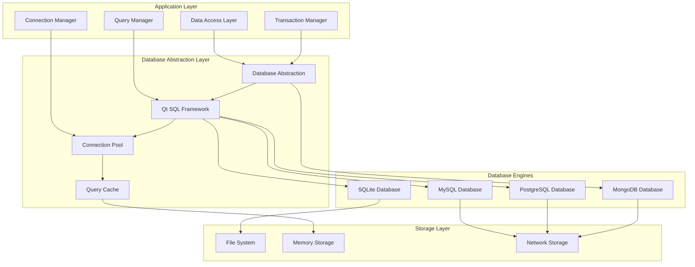

# Phân Tích Database và Storage System

Tài liệu này cung cấp phân tích chi tiết về hệ thống database và storage của BrowserAutomationStudio, bao gồm architecture, performance optimization và data management strategies.

## 📋 Mục Lục

- [Database Architecture](#database-architecture)
- [Connection Management](#connection-management)
- [Query Optimization](#query-optimization)
- [Data Access Layer](#data-access-layer)
- [Caching Strategy](#caching-strategy)
- [Transaction Management](#transaction-management)
- [Performance Monitoring](#performance-monitoring)

## 🏗️ Database Architecture

### Multi-Database Support Architecture



### Database State Management

```cpp
class DatabaseStateManager {
private:
    struct DatabaseConnection {
        QString connectionName;
        QString databaseType;
        QString connectionString;
        QSqlDatabase database;
        QDateTime lastUsed;
        bool isActive;
        int useCount;
        QMutex connectionMutex;
    };
    
    struct ConnectionPool {
        QString poolName;
        int maxConnections;
        int minConnections;
        int currentConnections;
        QQueue<DatabaseConnection*> availableConnections;
        QSet<DatabaseConnection*> activeConnections;
        QMutex poolMutex;
        QWaitCondition connectionAvailable;
    };
    
    QHash<QString, ConnectionPool*> _connectionPools;
    QHash<QString, DatabaseConnection*> _namedConnections;
    QTimer* _cleanupTimer;
    QMutex _managerMutex;
    
    // Performance monitoring
    struct DatabaseMetrics {
        qint64 totalQueries;
        qint64 totalExecutionTime;
        qint64 averageExecutionTime;
        int activeConnections;
        int failedQueries;
        QDateTime lastActivity;
    };
    
    QHash<QString, DatabaseMetrics> _databaseMetrics;
    
public:
    DatabaseStateManager(QObject* parent = nullptr) : QObject(parent) {
        InitializeConnectionPools();
        SetupCleanupTimer();
        SetupPerformanceMonitoring();
    }
    
    DatabaseConnection* AcquireConnection(const QString& poolName, int timeoutMs = 30000) {
        QMutexLocker managerLocker(&_managerMutex);
        
        auto pool = _connectionPools.value(poolName);
        if (!pool) {
            throw DatabaseException(QString("Connection pool not found: %1").arg(poolName));
        }
        
        QMutexLocker poolLocker(&pool->poolMutex);
        managerLocker.unlock();
        
        // Wait for available connection
        QElapsedTimer timer;
        timer.start();
        
        while (pool->availableConnections.isEmpty() && timer.elapsed() < timeoutMs) {
            if (pool->currentConnections < pool->maxConnections) {
                // Create new connection
                auto connection = CreateNewConnection(poolName);
                if (connection) {
                    pool->activeConnections.insert(connection);
                    pool->currentConnections++;
                    UpdateMetrics(poolName, connection);
                    return connection;
                }
            }
            
            // Wait for connection to become available
            pool->connectionAvailable.wait(&pool->poolMutex, 
                                          timeoutMs - timer.elapsed());
        }
        
        if (!pool->availableConnections.isEmpty()) {
            auto connection = pool->availableConnections.dequeue();
            pool->activeConnections.insert(connection);
            
            // Validate connection
            if (!ValidateConnection(connection)) {
                // Connection is stale, create new one
                delete connection;
                pool->currentConnections--;
                connection = CreateNewConnection(poolName);
                if (connection) {
                    pool->activeConnections.insert(connection);
                    pool->currentConnections++;
                }
            }
            
            if (connection) {
                connection->lastUsed = QDateTime::currentDateTime();
                connection->useCount++;
                UpdateMetrics(poolName, connection);
            }
            
            return connection;
        }
        
        throw DatabaseException("Connection timeout: no connections available");
    }
    
    void ReleaseConnection(DatabaseConnection* connection) {
        if (!connection) return;
        
        QMutexLocker managerLocker(&_managerMutex);
        
        // Find the pool this connection belongs to
        ConnectionPool* pool = nullptr;
        for (auto it = _connectionPools.begin(); it != _connectionPools.end(); ++it) {
            QMutexLocker poolLocker(&it.value()->poolMutex);
            if (it.value()->activeConnections.contains(connection)) {
                pool = it.value();
                pool->activeConnections.remove(connection);
                break;
            }
        }
        
        if (!pool) {
            qWarning() << "Connection not found in any pool";
            delete connection;
            return;
        }
        
        QMutexLocker poolLocker(&pool->poolMutex);
        managerLocker.unlock();
        
        // Check if connection should be kept or discarded
        if (ShouldKeepConnection(connection, pool)) {
            pool->availableConnections.enqueue(connection);
            pool->connectionAvailable.wakeOne();
        } else {
            delete connection;
            pool->currentConnections--;
        }
    }
    
private:
    DatabaseConnection* CreateNewConnection(const QString& poolName) {
        auto connectionConfig = GetConnectionConfig(poolName);
        
        auto connection = new DatabaseConnection();
        connection->connectionName = QString("%1_%2_%3")
                                   .arg(poolName)
                                   .arg(QThread::currentThreadId())
                                   .arg(QDateTime::currentMSecsSinceEpoch());
        connection->databaseType = connectionConfig.type;
        connection->connectionString = connectionConfig.connectionString;
        connection->lastUsed = QDateTime::currentDateTime();
        connection->isActive = false;
        connection->useCount = 0;
        
        // Create Qt database connection
        connection->database = QSqlDatabase::addDatabase(
            connectionConfig.driver, connection->connectionName);
        
        // Configure connection based on type
        ConfigureConnection(connection, connectionConfig);
        
        // Open connection
        if (!connection->database.open()) {
            qWarning() << "Failed to open database connection:" 
                      << connection->database.lastError().text();
            delete connection;
            return nullptr;
        }
        
        connection->isActive = true;
        
        // Optimize connection settings
        OptimizeConnection(connection);
        
        return connection;
    }
    
    void ConfigureConnection(DatabaseConnection* connection, 
                           const DatabaseConfig& config) {
        auto& db = connection->database;
        
        switch (config.type) {
        case DatabaseType::SQLite:
            db.setDatabaseName(config.databaseName);
            break;
            
        case DatabaseType::MySQL:
        case DatabaseType::PostgreSQL:
            db.setHostName(config.hostName);
            db.setPort(config.port);
            db.setDatabaseName(config.databaseName);
            db.setUserName(config.userName);
            db.setPassword(config.password);
            
            // Set connection options
            if (!config.options.isEmpty()) {
                db.setConnectOptions(config.options);
            }
            break;
        }
    }
    
    void OptimizeConnection(DatabaseConnection* connection) {
        QSqlQuery query(connection->database);
        
        switch (GetDatabaseType(connection->databaseType)) {
        case DatabaseType::SQLite:
            // SQLite optimizations
            query.exec("PRAGMA journal_mode = WAL");
            query.exec("PRAGMA synchronous = NORMAL");
            query.exec("PRAGMA cache_size = 10000");
            query.exec("PRAGMA temp_store = MEMORY");
            query.exec("PRAGMA mmap_size = 268435456"); // 256MB
            break;
            
        case DatabaseType::MySQL:
            // MySQL optimizations
            query.exec("SET SESSION sql_mode = 'STRICT_TRANS_TABLES'");
            query.exec("SET SESSION autocommit = 1");
            query.exec("SET SESSION query_cache_type = ON");
            break;
            
        case DatabaseType::PostgreSQL:
            // PostgreSQL optimizations
            query.exec("SET synchronous_commit = off");
            query.exec("SET wal_buffers = '16MB'");
            query.exec("SET checkpoint_segments = 32");
            break;
        }
    }
    
    bool ValidateConnection(DatabaseConnection* connection) {
        if (!connection || !connection->isActive) {
            return false;
        }
        
        // Check if connection is still valid
        if (!connection->database.isOpen()) {
            return false;
        }
        
        // Perform a simple query to test connection
        QSqlQuery testQuery(connection->database);
        switch (GetDatabaseType(connection->databaseType)) {
        case DatabaseType::SQLite:
            return testQuery.exec("SELECT 1");
        case DatabaseType::MySQL:
            return testQuery.exec("SELECT 1");
        case DatabaseType::PostgreSQL:
            return testQuery.exec("SELECT 1");
        default:
            return true;
        }
    }
    
    bool ShouldKeepConnection(DatabaseConnection* connection, ConnectionPool* pool) {
        // Check connection age
        qint64 connectionAge = connection->lastUsed.msecsTo(QDateTime::currentDateTime());
        if (connectionAge > 300000) { // 5 minutes
            return false;
        }
        
        // Check pool size
        if (pool->availableConnections.size() >= pool->minConnections) {
            return false;
        }
        
        // Check connection health
        return ValidateConnection(connection);
    }
    
    void UpdateMetrics(const QString& poolName, DatabaseConnection* connection) {
        auto& metrics = _databaseMetrics[poolName];
        metrics.activeConnections = _connectionPools[poolName]->activeConnections.size();
        metrics.lastActivity = QDateTime::currentDateTime();
    }
};
```

## 🔍 Query Optimization

### Advanced Query Builder and Optimizer

```cpp
class QueryOptimizer {
private:
    struct QueryPlan {
        QString originalQuery;
        QString optimizedQuery;
        QStringList usedIndexes;
        qint64 estimatedCost;
        QDateTime createdAt;
        int useCount;
    };
    
    QCache<QString, QueryPlan> _queryPlanCache;
    QHash<QString, QStringList> _tableIndexes;
    QHash<QString, TableStatistics> _tableStats;
    
public:
    OptimizedQuery OptimizeQuery(const QString& query, const QString& databaseType) {
        // Check cache first
        QString queryHash = QCryptographicHash::hash(
            query.toUtf8(), QCryptographicHash::Md5).toHex();
        
        if (auto cachedPlan = _queryPlanCache.object(queryHash)) {
            cachedPlan->useCount++;
            return CreateOptimizedQuery(*cachedPlan);
        }
        
        // Parse query
        auto parsedQuery = ParseSQLQuery(query);
        if (!parsedQuery.isValid) {
            return OptimizedQuery::Invalid(parsedQuery.errors);
        }
        
        // Analyze query structure
        auto analysis = AnalyzeQuery(parsedQuery);
        
        // Apply optimizations
        auto optimizedQuery = ApplyOptimizations(parsedQuery, analysis, databaseType);
        
        // Create query plan
        QueryPlan plan;
        plan.originalQuery = query;
        plan.optimizedQuery = optimizedQuery.sql;
        plan.usedIndexes = analysis.recommendedIndexes;
        plan.estimatedCost = EstimateQueryCost(optimizedQuery, analysis);
        plan.createdAt = QDateTime::currentDateTime();
        plan.useCount = 1;
        
        // Cache the plan
        _queryPlanCache.insert(queryHash, new QueryPlan(plan));
        
        return optimizedQuery;
    }
    
private:
    struct ParsedQuery {
        bool isValid;
        QStringList errors;
        QString queryType; // SELECT, INSERT, UPDATE, DELETE
        QStringList tables;
        QStringList columns;
        QStringList whereConditions;
        QStringList joinConditions;
        QStringList orderByColumns;
        QStringList groupByColumns;
        QString limitClause;
        bool hasSubqueries;
    };
    
    struct QueryAnalysis {
        QStringList missingIndexes;
        QStringList recommendedIndexes;
        QStringList inefficientConditions;
        bool canUseIndex;
        bool hasCartesianProduct;
        int estimatedRows;
        QStringList optimizationSuggestions;
    };
    
    ParsedQuery ParseSQLQuery(const QString& query) {
        ParsedQuery result;
        result.isValid = true;
        
        // Simple SQL parser (in production, use a proper SQL parser)
        QString normalizedQuery = query.simplified().toLower();
        
        // Determine query type
        if (normalizedQuery.startsWith("select")) {
            result.queryType = "SELECT";
            ParseSelectQuery(normalizedQuery, result);
        } else if (normalizedQuery.startsWith("insert")) {
            result.queryType = "INSERT";
            ParseInsertQuery(normalizedQuery, result);
        } else if (normalizedQuery.startsWith("update")) {
            result.queryType = "UPDATE";
            ParseUpdateQuery(normalizedQuery, result);
        } else if (normalizedQuery.startsWith("delete")) {
            result.queryType = "DELETE";
            ParseDeleteQuery(normalizedQuery, result);
        } else {
            result.isValid = false;
            result.errors.append("Unsupported query type");
        }
        
        return result;
    }
    
    void ParseSelectQuery(const QString& query, ParsedQuery& result) {
        // Extract tables from FROM clause
        QRegularExpression fromRegex(R"(\bfrom\s+([^where^group^order^limit]+))");
        auto fromMatch = fromRegex.match(query);
        if (fromMatch.hasMatch()) {
            QString fromClause = fromMatch.captured(1).trimmed();
            result.tables = ExtractTableNames(fromClause);
        }
        
        // Extract WHERE conditions
        QRegularExpression whereRegex(R"(\bwhere\s+(.+?)(?:\bgroup\b|\border\b|\blimit\b|$))");
        auto whereMatch = whereRegex.match(query);
        if (whereMatch.hasMatch()) {
            QString whereClause = whereMatch.captured(1).trimmed();
            result.whereConditions = ExtractConditions(whereClause);
        }
        
        // Extract ORDER BY
        QRegularExpression orderRegex(R"(\border\s+by\s+([^limit]+))");
        auto orderMatch = orderRegex.match(query);
        if (orderMatch.hasMatch()) {
            QString orderClause = orderMatch.captured(1).trimmed();
            result.orderByColumns = ExtractColumnNames(orderClause);
        }
        
        // Extract GROUP BY
        QRegularExpression groupRegex(R"(\bgroup\s+by\s+([^order^limit]+))");
        auto groupMatch = groupRegex.match(query);
        if (groupMatch.hasMatch()) {
            QString groupClause = groupMatch.captured(1).trimmed();
            result.groupByColumns = ExtractColumnNames(groupClause);
        }
        
        // Check for subqueries
        result.hasSubqueries = query.contains(QRegularExpression(R"(\(\s*select\b)"));
    }
    
    QueryAnalysis AnalyzeQuery(const ParsedQuery& parsedQuery) {
        QueryAnalysis analysis;
        
        // Check for missing indexes
        for (const auto& table : parsedQuery.tables) {
            auto tableIndexes = _tableIndexes.value(table);
            
            // Analyze WHERE conditions for index opportunities
            for (const auto& condition : parsedQuery.whereConditions) {
                auto columnName = ExtractColumnFromCondition(condition);
                if (!columnName.isEmpty() && !HasIndexOnColumn(table, columnName)) {
                    analysis.missingIndexes.append(QString("%1.%2").arg(table, columnName));
                    analysis.recommendedIndexes.append(
                        QString("CREATE INDEX idx_%1_%2 ON %1(%2)").arg(table, columnName));
                }
            }
            
            // Check ORDER BY columns for indexes
            for (const auto& column : parsedQuery.orderByColumns) {
                if (!HasIndexOnColumn(table, column)) {
                    analysis.recommendedIndexes.append(
                        QString("CREATE INDEX idx_%1_%2 ON %1(%2)").arg(table, column));
                }
            }
        }
        
        // Check for Cartesian products
        if (parsedQuery.tables.size() > 1 && parsedQuery.joinConditions.isEmpty()) {
            analysis.hasCartesianProduct = true;
            analysis.optimizationSuggestions.append("Add JOIN conditions to avoid Cartesian product");
        }
        
        // Estimate result set size
        analysis.estimatedRows = EstimateResultSetSize(parsedQuery);
        
        // Check for inefficient patterns
        CheckForInefficientPatterns(parsedQuery, analysis);
        
        return analysis;
    }
    
    OptimizedQuery ApplyOptimizations(const ParsedQuery& parsedQuery, 
                                    const QueryAnalysis& analysis,
                                    const QString& databaseType) {
        OptimizedQuery result;
        result.originalQuery = parsedQuery;
        
        QString optimizedSQL = parsedQuery.originalQuery;
        
        // Apply database-specific optimizations
        if (databaseType == "SQLite") {
            optimizedSQL = ApplySQLiteOptimizations(optimizedSQL, analysis);
        } else if (databaseType == "MySQL") {
            optimizedSQL = ApplyMySQLOptimizations(optimizedSQL, analysis);
        } else if (databaseType == "PostgreSQL") {
            optimizedSQL = ApplyPostgreSQLOptimizations(optimizedSQL, analysis);
        }
        
        // Apply general optimizations
        optimizedSQL = ApplyGeneralOptimizations(optimizedSQL, analysis);
        
        result.sql = optimizedSQL;
        result.estimatedImprovement = CalculateImprovement(parsedQuery, analysis);
        result.appliedOptimizations = GetAppliedOptimizations(analysis);
        
        return result;
    }
    
    QString ApplySQLiteOptimizations(const QString& query, const QueryAnalysis& analysis) {
        QString optimized = query;
        
        // Add INDEXED BY hints if beneficial
        if (!analysis.recommendedIndexes.isEmpty()) {
            // This is a simplified example - real implementation would be more sophisticated
            for (const auto& table : analysis.missingIndexes) {
                if (HasSuitableIndex(table)) {
                    QString indexHint = QString(" INDEXED BY %1").arg(GetBestIndex(table));
                    optimized.replace(table, table + indexHint);
                }
            }
        }
        
        // Optimize LIMIT queries
        if (optimized.contains("LIMIT") && !optimized.contains("ORDER BY")) {
            // Add ORDER BY for consistent results
            optimized.replace("LIMIT", "ORDER BY rowid LIMIT");
        }
        
        return optimized;
    }
    
    QString ApplyMySQLOptimizations(const QString& query, const QueryAnalysis& analysis) {
        QString optimized = query;
        
        // Add USE INDEX hints
        for (const auto& table : analysis.missingIndexes) {
            if (HasSuitableIndex(table)) {
                QString indexHint = QString(" USE INDEX (%1)").arg(GetBestIndex(table));
                optimized.replace(table, table + indexHint);
            }
        }
        
        // Optimize JOIN order for MySQL
        if (query.contains("JOIN")) {
            optimized = OptimizeJoinOrder(optimized, "MySQL");
        }
        
        return optimized;
    }
    
    qint64 EstimateQueryCost(const OptimizedQuery& query, const QueryAnalysis& analysis) {
        qint64 cost = 0;
        
        // Base cost for table scans
        for (const auto& table : query.originalQuery.tables) {
            auto stats = _tableStats.value(table);
            cost += stats.rowCount;
        }
        
        // Reduce cost for indexed access
        if (analysis.canUseIndex) {
            cost /= 10; // Rough estimate - indexes provide 10x improvement
        }
        
        // Increase cost for joins
        if (query.originalQuery.tables.size() > 1) {
            cost *= query.originalQuery.tables.size();
        }
        
        // Increase cost for sorting
        if (!query.originalQuery.orderByColumns.isEmpty()) {
            cost *= 2;
        }
        
        return cost;
    }
};
```

---

*Tài liệu này tiếp tục với các phần về Data Access Layer, Caching Strategy, Transaction Management và Performance Monitoring.*
