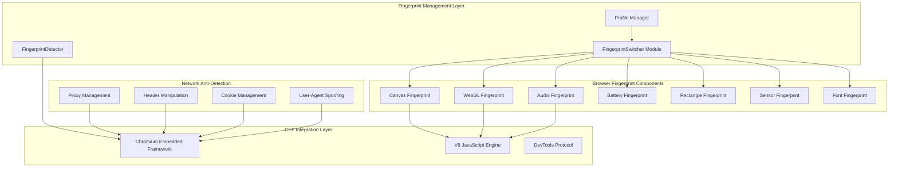

# Phân Tích Hệ Thống Fingerprint và Anti-Detection

Tài liệu này cung cấp phân tích chi tiết về hệ thống fingerprint và các cơ chế anti-detection trong BrowserAutomationStudio.

## 📋 Mục Lục

- [Tổng Quan Hệ Thống Fingerprint](#tổng-quan-hệ-thống-fingerprint)
- [Kiến Trúc FingerprintSwitcher](#kiến-trúc-fingerprintswitcher)
- [Các Loại Fingerprint](#các-loại-fingerprint)
- [Cơ Chế Anti-Detection](#cơ-chế-anti-detection)
- [FingerprintDetector](#fingerprintdetector)
- [Quản Lý Proxy và Network](#quản-lý-proxy-và-network)
- [Phân Tích Bảo Mật](#phân-tích-bảo-mật)

## 🔍 Tổng Quan Hệ Thống Fingerprint

### Kiến Trúc Tổng Thể



### Core Fingerprint System

<augment_code_snippet path="Solution/Modules/FingerprintSwitcher/js/engine.js" mode="EXCERPT">
````javascript
function BrowserAutomationStudio_ApplyFingerprint()
{
    FINGERPRINT_JSON = _arguments()[0]
    
    if(_arguments().length > 1 && FINGERPRINT_JSON["canvas"])
        FINGERPRINT_CANVAS = _arguments()[1]
    if(_arguments().length > 2 && FINGERPRINT_JSON["webgl"])
        FINGERPRINT_WEBGL = _arguments()[2]
    if(_arguments().length > 3 && FINGERPRINT_JSON["audio"])
        FINGERPRINT_AUDIO = _arguments()[3]
    if(_arguments().length > 4 && FINGERPRINT_JSON["battery"])
        FINGERPRINT_BATTERY = _arguments()[4]
    if(_arguments().length > 5 && FINGERPRINT_JSON["rectangles"])
        FINGERPRINT_RECTANGLES = _arguments()[5]
````
</augment_code_snippet>

## 🎨 Kiến Trúc FingerprintSwitcher

### Module Structure

```cpp
// FingerprintSwitcher Module Architecture
class FingerprintSwitcher {
private:
    // Core fingerprint components
    CanvasFingerprint canvas_fp;
    WebGLFingerprint webgl_fp;
    AudioFingerprint audio_fp;
    BatteryFingerprint battery_fp;
    RectangleFingerprint rect_fp;
    SensorFingerprint sensor_fp;
    FontFingerprint font_fp;
    
    // Configuration management
    FingerprintConfig config;
    ProfileManager profile_mgr;
    
    // API integration
    FingerprintAPI api_client;
    PerfectCanvasAPI perfect_canvas;
    
public:
    void ApplyFingerprint(const FingerprintData& data);
    FingerprintData GetFingerprint(const FingerprintRequest& request);
    void SaveToProfile(const QString& profile_path);
    void LoadFromProfile(const QString& profile_path);
};
```

### Fingerprint Application Process

<augment_code_snippet path="Solution/Modules/FingerprintSwitcher/js/apply_fingerprint_code.js" mode="EXCERPT">
````javascript
/*Browser*/
_call(BrowserAutomationStudio_ApplyFingerprint,[
    <%= fingerprint %>,
    <%= canvas %> == "true",
    <%= webgl %> == "true",
    <%= audio %> == "true",
    <%= battery %> == "true",
    <%= rectangles %> == "true",
    <%= perfectcanvas %> == "true",
    <%= sensor %> == "true",
    <%= font_data %> == "true",
    <%= device_scale %> == "true"
])!
sleep(1000)!
````
</augment_code_snippet>

## 🖼️ Các Loại Fingerprint

### 1. Canvas Fingerprinting

**Mục đích**: Thay đổi dữ liệu canvas để tránh bị phát hiện
**Cơ chế**: Thêm noise vào dữ liệu pixel canvas

```javascript
// Canvas Noise Implementation
if(FINGERPRINT_CANVAS) {
    Settings["Canvas"] = "noise"
    Settings["CanvasNoise"] = FINGERPRINT_JSON["canvas"]
    Settings["Fingerprints.PerfectCanvasSkipZeroEntropyCode"] = "Enable"
}
```

**Đặc điểm kỹ thuật**:
- Sử dụng noise pattern để thay đổi pixel data
- Hỗ trợ PerfectCanvas technology cho độ chính xác cao
- Tích hợp với CanvasInspector application

### 2. WebGL Fingerprinting

**Mục đích**: Thay đổi thông tin hardware và WebGL properties
**Cơ chế**: Spoofing GPU vendor, renderer và các thuộc tính WebGL

```javascript
// WebGL Properties Spoofing
if(FINGERPRINT_WEBGL) {
    Settings["Webgl"] = "noise"
    Settings["WebglNoise"] = FINGERPRINT_JSON["webgl"]
    
    var Keys = Object.keys(FINGERPRINT_JSON["webgl_properties"])
    for(var i = 0; i < Keys.length; i++) {
        var Key = Keys[i]
        var Value = FINGERPRINT_JSON["webgl_properties"][Key]
        Settings["Webgl." + Key] = Value
    }
}
```

**Các thuộc tính được thay đổi**:
- GPU Vendor (NVIDIA, AMD, Intel)
- GPU Renderer
- WebGL Version
- Supported Extensions
- Shader Precision

### 3. Audio Fingerprinting

**Mục đích**: Thay đổi audio context fingerprint
**Cơ chế**: Thêm noise vào AudioContext API

```javascript
// Audio Context Manipulation
if(FINGERPRINT_AUDIO) {
    Settings["Audio"] = "noise"
    Settings["AudioNoise"] = FINGERPRINT_JSON["audio"]
}
```

### 4. Battery API Fingerprinting

**Mục đích**: Thay đổi thông tin battery để tránh tracking
**Cơ chế**: Spoofing battery level, charging status

```javascript
// Battery API Spoofing
if(FINGERPRINT_BATTERY) {
    Settings["Fingerprints.BatteryReplace"] = "true"
    Settings["Fingerprints.BatteryFingerprint"] = FINGERPRINT_JSON["battery"]
}
```

### 5. Rectangle/Screen Fingerprinting

**Mục đích**: Thay đổi thông tin màn hình và viewport
**Cơ chế**: Spoofing screen resolution, available screen space

```javascript
// Screen Properties Spoofing
if(FINGERPRINT_RECTANGLES) {
    Settings["Fingerprints.RectanglesReplace"] = "true"
    Settings["Fingerprints.RectanglesFingerprint"] = FINGERPRINT_JSON["rectangles"]
}
```

### 6. Sensor Fingerprinting

**Mục đích**: Thay đổi thông tin sensors (accelerometer, gyroscope)
**Cơ chế**: Spoofing device motion và orientation events

### 7. Font Fingerprinting

**Mục đích**: Thay đổi danh sách fonts có sẵn
**Cơ chế**: Spoofing font enumeration APIs

## 🛡️ Cơ Chế Anti-Detection

### Device Mode Spoofing

<augment_code_snippet path="Solution/Engine/scripts/engine/worker/worker.js" mode="EXCERPT">
````javascript
if(_ARG[0] == "desktop") {
    _IS_MOBILE = false;
    current_settings = {
        "Fingerprints.Setting.forceAndroidOverlayScrollbar":"Disable",
        "Fingerprints.Setting.passwordEchoEnabled":"Disable",
        "Fingerprints.Setting.textAreasAreResizable":"Enable",
        "Fingerprints.Setting.useSolidColorScrollbars":"Disable",
        "Fingerprints.Setting.availablePointerTypes":"4",
        "Fingerprints.Setting.availableHoverTypes":"2",
        "Fingerprints.Setting.primaryPointerType":"4",
        "Fingerprints.Setting.primaryHoverType":"2",
        "Fingerprints.BrowserMode":"Desktop",
        "Fingerprints.Feature.TouchEventFeatureDetection":"Disable"
    }
}
````
</augment_code_snippet>

### User-Agent Management

<augment_code_snippet path="Solution/Engine/scripts/engine/worker/cache.js" mode="EXCERPT">
````javascript
function header(name, value, callback) {
    if(!_is_bas_browser_real() && name == "User-Agent") {
        _settings({"multilogin.fingerprintGeneration.userAgent":JSON.stringify(value)}, callback)
        return
    }
    if(!_is_bas_browser_real() && name == "Accept-Language") {
        _settings({"multilogin.fingerprintGeneration.langHdr":JSON.stringify(value)}, callback)
        return
    }
    // ... header processing
}
````
</augment_code_snippet>

## 🔍 FingerprintDetector

### Detector Architecture

<augment_code_snippet path="Solution/ChromeWorker/fingerprintdetector.h" mode="EXCERPT">
````cpp
class FingerprintDetector {
    std::string UniqueId;
    bool IsInitialized = false;
    time_t LastTimer = 0;
    std::vector<std::string> DataPending;
    std::string DataPending2;
    std::atomic_int LastGroupCount;
    
public:
    FingerprintDetector();
    void Init(const std::string& UniqueId);
    int Timer(CefRefPtr<CefBrowser> DetectorBrowser, bool Initialized);
    void BrowserData(CefRefPtr<CefBrowser> DetectorBrowser, const std::string& Data, bool Initialized);
    int GetLastGroupCount();
};
````
</augment_code_snippet>

### Detection Process

```cpp
// Fingerprint Detection Implementation
int FingerprintDetector::Timer(CefRefPtr<CefBrowser> DetectorBrowser, bool Initialized) {
    int Res = 0;
    std::string ToSend;
    
    // Read detection data from file
    std::string Filename = std::string("s/") + UniqueId + std::string(".detect");
    std::ifstream Detect(Filename);
    std::string Line;
    
    while(std::getline(Detect, Line)) {
        int Level = 0;
        if(!Line.empty()) {
            Level = std::stoi(Line.substr(0,1));
            Line.erase(0,1);
        }
        
        Data.push_back(Line);
        LastGroupCount++;
        
        if(Level >= 5)
            Res += 1;  // High-risk detection
    }
    
    // Send data to detector browser
    if(!ToSend.empty())
        DetectorBrowser->GetMainFrame()->ExecuteJavaScript(ToSend,"",0);
    
    return Res;
}
```

### Detection Integration

<augment_code_snippet path="Solution/ChromeWorker/mainapp.cpp" mode="EXCERPT">
````cpp
if(Data->IsRecord) {
    if(Settings->Detector()) {
        int NewFingerprintDataNumber = Detector.Timer(BrowserDetector, 
            detector8handler && detector8handler->GetIsInitialized());
        if(NewFingerprintDataNumber > 0)
            Layout->UpdateFingerprintDetectorNumber(
                Layout->GetFingerprintDetectorNumber() + NewFingerprintDataNumber);
        
        // Auto-disable detector if too many detections
        if(Detector.GetLastGroupCount() > 1000) {
            Data->Saver.TemporaryDisableDetector = true;
            Data->Saver.Save();
        }
    }
}
````
</augment_code_snippet>

## 🌐 Quản Lý Proxy và Network

### Proxy Management Architecture

```cpp
class ProxyManager {
private:
    struct ProxyConfig {
        std::string server;
        int port;
        bool is_http;
        std::string username;
        std::string password;
        bool is_active;
    };
    
    ProxyConfig current_proxy;
    std::vector<ProxyConfig> proxy_pool;
    
public:
    void SetProxy(const std::string& server, int port, bool is_http, 
                  const std::string& username, const std::string& password);
    void RotateProxy();
    bool IsProxyActive() const;
    ProxyConfig GetCurrentProxy() const;
};
```

### Proxy Implementation

<augment_code_snippet path="Solution/Engine/scripts/engine/worker/cache.js" mode="EXCERPT">
````javascript
function set_proxy(server, Port, IsHttp, name, password, callback) {
    _PROXY["Port"] = Port
    _PROXY["IsHttp"] = IsHttp
    _PROXY["name"] = name
    _PROXY["password"] = password
    _PROXY["target"] = _get_target()
    _PROXY["server"] = server

    if(_is_ip(server)) {
        _settings(_PROXY, callback)
    } else {
        // DNS resolution for domain names
        _dns_lookup(server, function(){
            if(_result().length == 0)
                fail("Failed to resolve " + server)
            else {
                _PROXY["server"] = _result()[0]
                _settings(_PROXY, callback)
            }
        })
    }
}
````
</augment_code_snippet>

### Network Request Interception

<augment_code_snippet path="Solution/ChromeWorker/mainhandler.cpp" mode="EXCERPT">
````cpp
CefResourceRequestHandler::ReturnValue MainHandler::OnBeforeResourceLoad(
    CefRefPtr<CefBrowser> browser, 
    CefRefPtr<CefFrame> frame, 
    CefRefPtr<CefRequest> request, 
    CefRefPtr<CefRequestCallback> callback) {
    
    bool Accept = true;
    std::string url = request->GetURL().ToString();
    
    // Block fingerprinting scripts
    if(starts_with(url,"http://fingerprints.bablosoft.com/client.js") || 
       starts_with(url,"https://fingerprints.bablosoft.com/client.js")) {
        return RV_CANCEL;
    }
    
    // Apply request masks
    for(std::pair<bool, std::string> p : Data->_RequestMask) {
        if(match(p.second, url)) {
            Accept = p.first;
        }
    }
    
    return Accept ? RV_CONTINUE : RV_CANCEL;
}
````
</augment_code_snippet>

## 🍪 Cookie Management System

### Cookie Architecture

```cpp
class CookieManager {
private:
    struct CookieData {
        std::string name;
        std::string value;
        std::string domain;
        std::string path;
        bool secure;
        bool http_only;
        time_t expires;
    };

    std::vector<CookieData> cookie_store;
    std::string profile_path;

public:
    void SaveCookies(const std::string& profile);
    void RestoreCookies(const std::string& profile);
    void ClearCookies();
    std::string GetCookiesForUrl(const std::string& url);
};
```

### Cookie Implementation

<augment_code_snippet path="Solution/Engine/httpclient.cpp" mode="EXCERPT">
````cpp
QString HttpClient::SaveCookies() {
    NetworkCookieJar * jar = qobject_cast<NetworkCookieJar*>(network_manager->cookieJar());

    QString res;
    bool first = true;
    foreach(QNetworkCookie cookie, jar->AllCookies()) {
        if(!first)
            res.append(";");
        first = false;

        res.append(cookie.toRawForm(QNetworkCookie::Full).toBase64());
    }
    return res;
}

void HttpClient::RestoreCookies(const QString& cookies) {
    NetworkCookieJar * jar = qobject_cast<NetworkCookieJar*>(network_manager->cookieJar());

    // Clear existing cookies
    foreach(QNetworkCookie cookie, jar->AllCookies()) {
        jar->deleteCookie(cookie);
    }

    // Restore cookies from base64 encoded string
    QStringList list = cookies.split(";");
    foreach(QString cookie, list) {
        QByteArray cookieData = QByteArray::fromBase64(cookie.toLatin1());
        QList<QNetworkCookie> cs = QNetworkCookie::parseCookies(cookieData);
        if(!cs.isEmpty()) {
            jar->insertCookie(cs.first());
        }
    }
}
````
</augment_code_snippet>

### Cookie Visitor Pattern

<augment_code_snippet path="Solution/ChromeWorker/cookievisitor.cpp" mode="EXCERPT">
````cpp
bool CookieVisitor::Visit(const CefCookie& cookie, int count, int total, bool& deleteCookie) {
    deleteCookie = false;

    std::wstring name(cookie.value.str, cookie.value.length);

    if(ws2s(name) != std::string("basnone")) {
        bool DoPush = true;
        if(!UrlToVisit.empty()) {
            std::wstring domain(cookie.domain.str, cookie.domain.length);
            std::string domain_string = ws2s(domain);
            if(!domain_string.empty()) {
                if(domain_string[0] == '.')
                    domain_string.erase(domain_string.begin());

                std::size_t pos = UrlToVisit.find(domain_string);
                if(pos == std::string::npos) {
                    DoPush = false;
                }
            }
        }
        if(DoPush)
            cookies_json.push_back(picojson::value(SerializeCookie(cookie)));
    }

    return true;
}
````
</augment_code_snippet>

## ⚡ Performance Fingerprinting

### Performance Deformation

<augment_code_snippet path="Solution/Modules/FingerprintSwitcher/js/engine.js" mode="EXCERPT">
````javascript
function BrowserAutomationStudio_PerformanceFingerprint() {
    FINGERPRINT_JSON = _arguments()
    if(!FINGERPRINT_JSON.time_deformation) {
        FINGERPRINT_JSON.time_deformation = Math.random() *
            (FINGERPRINT_JSON.time_deformation_to - FINGERPRINT_JSON.time_deformation_from) +
            FINGERPRINT_JSON.time_deformation_from
    }

    delete FINGERPRINT_JSON.time_deformation_to
    delete FINGERPRINT_JSON.time_deformation_from

    if(_get_profile().length > 0) {
        native("filesystem", "writefile", JSON.stringify({
            path: _get_profile() + "/performance.json",
            value: JSON.stringify(FINGERPRINT_JSON),
            base64: false,
            append: false
        }))
    }
}
````
</augment_code_snippet>

### Performance Metrics Manipulation

```javascript
// Performance API Spoofing
class PerformanceFingerprint {
    constructor(config) {
        this.timeDeformation = config.time_deformation;
        this.maxMeasurementTime = config.max_measurement_time;
        this.disablePrecision = config.disable_performance_precision;
    }

    manipulatePerformanceNow(originalValue) {
        if (this.disablePrecision) {
            return Math.floor(originalValue);
        }
        return originalValue + this.timeDeformation;
    }

    manipulateNavigationTiming(timing) {
        const deformation = this.timeDeformation;
        return {
            ...timing,
            navigationStart: timing.navigationStart + deformation,
            loadEventEnd: timing.loadEventEnd + deformation,
            domContentLoadedEventEnd: timing.domContentLoadedEventEnd + deformation
        };
    }
}
```

## 🔧 Advanced Anti-Detection Techniques

### 1. Perfect Canvas Technology

```javascript
// PerfectCanvas Implementation
class PerfectCanvasManager {
    constructor() {
        this.apiUrl = "https://fingerprints.bablosoft.com/api";
        this.requestQueue = [];
        this.responseCache = new Map();
    }

    async requestPerfectCanvas(canvasData) {
        const response = await fetch(this.apiUrl, {
            method: 'POST',
            headers: {
                'Content-Type': 'application/octet-stream',
                'Accept-Encoding': 'gzip, deflate'
            },
            body: canvasData
        });

        const result = await response.json();
        if (result.Status === "success") {
            return result.Data;
        } else {
            throw new Error(result.Message);
        }
    }

    async getPerfectCanvasResult(requestId) {
        const response = await fetch(`${this.apiUrl}/result/${requestId}`);
        return await response.json();
    }
}
```

### 2. Dynamic Fingerprint Generation

```cpp
class DynamicFingerprintGenerator {
private:
    std::random_device rd;
    std::mt19937 gen;
    std::uniform_real_distribution<> dis;

    struct FingerprintTemplate {
        std::string browser_version_range;
        std::vector<std::string> supported_extensions;
        std::vector<std::string> gpu_vendors;
        std::vector<std::string> screen_resolutions;
    };

    std::vector<FingerprintTemplate> templates;

public:
    DynamicFingerprintGenerator() : gen(rd()), dis(0.0, 1.0) {}

    FingerprintData GenerateFingerprint(const FingerprintRequest& request) {
        FingerprintData result;

        // Select random template based on constraints
        auto template_idx = SelectTemplate(request);
        const auto& tmpl = templates[template_idx];

        // Generate canvas noise
        result.canvas_noise = GenerateCanvasNoise();

        // Generate WebGL properties
        result.webgl_vendor = SelectRandom(tmpl.gpu_vendors);
        result.webgl_renderer = GenerateRenderer(result.webgl_vendor);

        // Generate screen properties
        result.screen_resolution = SelectRandom(tmpl.screen_resolutions);

        // Generate audio context properties
        result.audio_fingerprint = GenerateAudioFingerprint();

        return result;
    }

private:
    std::string GenerateCanvasNoise() {
        std::string noise;
        for (int i = 0; i < 1000; ++i) {
            noise += std::to_string(static_cast<int>(dis(gen) * 255));
            if (i < 999) noise += ",";
        }
        return noise;
    }

    std::string SelectRandom(const std::vector<std::string>& options) {
        if (options.empty()) return "";
        std::uniform_int_distribution<> idx_dis(0, options.size() - 1);
        return options[idx_dis(gen)];
    }
};
```

### 3. Stealth Mode Implementation

```cpp
class StealthModeManager {
private:
    bool stealth_enabled;
    std::set<std::string> blocked_apis;
    std::map<std::string, std::string> spoofed_properties;

public:
    void EnableStealthMode() {
        stealth_enabled = true;

        // Block fingerprinting APIs
        blocked_apis.insert("navigator.plugins");
        blocked_apis.insert("navigator.mimeTypes");
        blocked_apis.insert("screen.colorDepth");
        blocked_apis.insert("screen.pixelDepth");

        // Spoof common properties
        spoofed_properties["navigator.hardwareConcurrency"] = "4";
        spoofed_properties["navigator.deviceMemory"] = "8";
        spoofed_properties["navigator.maxTouchPoints"] = "0";
    }

    bool ShouldBlockAPI(const std::string& api_name) {
        return stealth_enabled && blocked_apis.count(api_name) > 0;
    }

    std::string GetSpoofedProperty(const std::string& property) {
        auto it = spoofed_properties.find(property);
        return it != spoofed_properties.end() ? it->second : "";
    }
};
```

## 📊 Fingerprint API Integration

### API Client Implementation

```javascript
class FingerprintAPIClient {
    constructor(apiKey) {
        this.apiKey = apiKey;
        this.baseUrl = "https://fingerprints.bablosoft.com";
        this.version = "5";
    }

    async getFingerprint(options = {}) {
        const params = new URLSearchParams({
            version: this.version,
            key: this.apiKey,
            tags: options.tags || "*",
            min_browser_version: options.min_browser_version || "*",
            max_browser_version: options.max_browser_version || "*",
            min_width: options.min_width || "1024",
            min_height: options.min_height || "768",
            max_width: options.max_width || "1920",
            max_height: options.max_height || "1080"
        });

        const response = await fetch(`${this.baseUrl}/api?${params}`);
        const data = await response.json();

        if (data.status === "success") {
            return this.processFingerprint(data.fingerprint);
        } else {
            throw new Error(data.message || "Failed to get fingerprint");
        }
    }

    processFingerprint(fingerprint) {
        return {
            userAgent: fingerprint.user_agent,
            canvas: fingerprint.canvas_noise,
            webgl: fingerprint.webgl_noise,
            audio: fingerprint.audio_noise,
            battery: fingerprint.battery_data,
            rectangles: fingerprint.screen_data,
            fonts: fingerprint.font_data,
            timezone: fingerprint.timezone,
            language: fingerprint.language,
            platform: fingerprint.platform
        };
    }
}
```

### Profile Integration

<augment_code_snippet path="Solution/Modules/Profiles/js/use_profile_code.js" mode="EXCERPT">
````javascript
_if(<%= load_fp %> == "true", function(){
    FINGERPRINT_JSON = native("filesystem", "readfile", JSON.stringify({
        value: (<%= profile %>) + "/fingerprint.json",
        base64: false,
        from: 0,
        to: 0
    }))

    _if(FINGERPRINT_JSON.length > 0, function(){
        FINGERPRINT_JSON = JSON.parse(FINGERPRINT_JSON)
        _call(BrowserAutomationStudio_ApplyFingerprint,[
            FINGERPRINT_JSON["fingerprint"],
            FINGERPRINT_JSON["canvas"],
            FINGERPRINT_JSON["webgl"],
            FINGERPRINT_JSON["audio"],
            FINGERPRINT_JSON["battery"],
            FINGERPRINT_JSON["rectangles"],
            FINGERPRINT_JSON["perfectcanvas"],
            FINGERPRINT_JSON["sensor"],
            FINGERPRINT_JSON["font_data"],
            FINGERPRINT_JSON["device_scale"]
        ])!
        sleep(1000)!
    })!
})!
````
</augment_code_snippet>

## 🛡️ Security Considerations

### 1. Fingerprint Data Protection

```cpp
class FingerprintSecurity {
private:
    std::string encryption_key;

public:
    std::string EncryptFingerprintData(const std::string& data) {
        // AES-256 encryption implementation
        return AESEncrypt(data, encryption_key);
    }

    std::string DecryptFingerprintData(const std::string& encrypted_data) {
        return AESDecrypt(encrypted_data, encryption_key);
    }

    bool ValidateFingerprintIntegrity(const FingerprintData& data) {
        // Validate fingerprint data consistency
        if (data.canvas_noise.empty() || data.webgl_vendor.empty()) {
            return false;
        }

        // Check for suspicious patterns
        if (data.screen_width > 7680 || data.screen_height > 4320) {
            return false;  // Unrealistic screen resolution
        }

        return true;
    }
};
```

### 2. Detection Evasion Metrics

```cpp
struct DetectionMetrics {
    int total_requests = 0;
    int blocked_requests = 0;
    int fingerprint_changes = 0;
    int detection_events = 0;
    double evasion_rate = 0.0;

    void UpdateEvasionRate() {
        if (total_requests > 0) {
            evasion_rate = 1.0 - (static_cast<double>(detection_events) / total_requests);
        }
    }

    bool IsEvasionEffective() const {
        return evasion_rate > 0.95;  // 95% evasion rate threshold
    }
};
```

## 📈 Performance Impact Analysis

### Fingerprint Application Overhead

```cpp
class PerformanceProfiler {
private:
    std::chrono::high_resolution_clock::time_point start_time;
    std::map<std::string, double> operation_times;

public:
    void StartTiming(const std::string& operation) {
        start_time = std::chrono::high_resolution_clock::now();
    }

    void EndTiming(const std::string& operation) {
        auto end_time = std::chrono::high_resolution_clock::now();
        auto duration = std::chrono::duration_cast<std::chrono::microseconds>(
            end_time - start_time).count();
        operation_times[operation] = duration / 1000.0;  // Convert to milliseconds
    }

    void LogPerformanceMetrics() {
        std::cout << "Fingerprint Performance Metrics:" << std::endl;
        for (const auto& [operation, time] : operation_times) {
            std::cout << operation << ": " << time << "ms" << std::endl;
        }
    }
};
```

### Memory Usage Optimization

```cpp
class FingerprintMemoryManager {
private:
    std::unique_ptr<ObjectPool<FingerprintData>> fingerprint_pool;
    std::unique_ptr<ObjectPool<CanvasNoise>> canvas_pool;

public:
    FingerprintMemoryManager() {
        fingerprint_pool = std::make_unique<ObjectPool<FingerprintData>>(100);
        canvas_pool = std::make_unique<ObjectPool<CanvasNoise>>(50);
    }

    FingerprintData* AcquireFingerprint() {
        return fingerprint_pool->Acquire();
    }

    void ReleaseFingerprint(FingerprintData* fp) {
        fingerprint_pool->Release(fp);
    }

    size_t GetMemoryUsage() const {
        return fingerprint_pool->GetAllocatedCount() * sizeof(FingerprintData) +
               canvas_pool->GetAllocatedCount() * sizeof(CanvasNoise);
    }
};
```

---

*Tài liệu này cung cấp phân tích toàn diện về hệ thống fingerprint và anti-detection của BrowserAutomationStudio, bao gồm các kỹ thuật nâng cao và considerations về bảo mật.*
