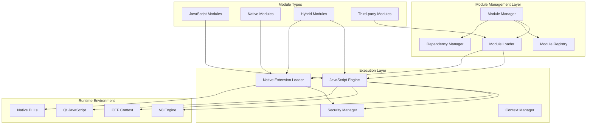

# Phân Tích Hệ Thống Module Chi Tiết

Tài liệu này cung cấp phân tích sâu về kiến trúc hệ thống module của BrowserAutomationStudio, bao gồm cơ chế loading, dependency management và extensibility.

## 📋 Mục Lục

- [Kiến Trúc Module System](#kiến-trúc-module-system)
- [Module Lifecycle Management](#module-lifecycle-management)
- [Dependency Resolution](#dependency-resolution)
- [JavaScript Engine Integration](#javascript-engine-integration)
- [Native Extension System](#native-extension-system)
- [Security và Sandboxing](#security-và-sandboxing)
- [Performance Optimization](#performance-optimization)

## 🏗️ Kiến Trúc Module System

### Tổng Quan Kiến Trúc



### Core Module Manager Implementation

```cpp
class AdvancedModuleManager : public IModuleManager {
private:
    struct ModuleMetadata {
        QString name;
        QString version;
        QString path;
        QJsonObject manifest;
        ModuleState state;
        QDateTime loadTime;
        QStringList dependencies;
        QStringList dependents;
        size_t memoryUsage;
        qint64 executionTime;
        int errorCount;
        bool isNative;
        QLibrary* nativeLibrary;
    };
    
    // Module storage and indexing
    QHash<QString, ModuleMetadata> _modules;
    QHash<QString, QList<ModuleAction>> _moduleActions;
    QMultiHash<QString, QString> _dependencyGraph;
    
    // Execution environments
    QScriptEngine* _scriptEngine;
    QHash<QString, QLibrary*> _nativeLibraries;
    
    // Security and monitoring
    ModuleSecurityManager* _securityManager;
    ModulePerformanceMonitor* _performanceMonitor;
    
    // Caching and optimization
    QCache<QString, CompiledModule> _compiledModuleCache;
    QTimer* _cacheCleanupTimer;
    
public:
    AdvancedModuleManager(QObject* parent = nullptr) : IModuleManager(parent) {
        InitializeScriptEngine();
        InitializeSecurityManager();
        InitializePerformanceMonitor();
        SetupCacheManagement();
    }
    
    ModuleLoadResult LoadModule(const QString& modulePath) override {
        QElapsedTimer loadTimer;
        loadTimer.start();
        
        try {
            // Read and validate manifest
            auto manifest = ReadModuleManifest(modulePath);
            auto validationResult = ValidateModuleManifest(manifest);
            if (!validationResult.isValid) {
                return ModuleLoadResult::ValidationFailed(validationResult.errors);
            }
            
            // Check dependencies
            auto dependencyResult = ResolveDependencies(manifest);
            if (!dependencyResult.isResolved) {
                return ModuleLoadResult::DependencyFailed(dependencyResult.missingDependencies);
            }
            
            // Security check
            auto securityResult = _securityManager->ValidateModule(modulePath, manifest);
            if (!securityResult.isSecure) {
                return ModuleLoadResult::SecurityFailed(securityResult.violations);
            }
            
            // Load module components
            ModuleMetadata metadata;
            metadata.name = manifest["name"].toString();
            metadata.version = manifest["version"].toString();
            metadata.path = modulePath;
            metadata.manifest = manifest;
            metadata.state = ModuleState::Loading;
            metadata.loadTime = QDateTime::currentDateTime();
            metadata.dependencies = ExtractDependencies(manifest);
            
            // Load JavaScript components
            if (manifest.contains("actions")) {
                LoadJavaScriptActions(modulePath, manifest, metadata);
            }
            
            // Load native components
            if (manifest.contains("dll")) {
                LoadNativeExtensions(modulePath, manifest, metadata);
            }
            
            // Register module
            metadata.state = ModuleState::Loaded;
            _modules.insert(metadata.name, metadata);
            
            // Update dependency graph
            UpdateDependencyGraph(metadata);
            
            qint64 loadTime = loadTimer.elapsed();
            _performanceMonitor->RecordModuleLoad(metadata.name, loadTime);
            
            emit ModuleLoaded(metadata.name);
            return ModuleLoadResult::Success(metadata.name);
            
        } catch (const ModuleException& e) {
            return ModuleLoadResult::LoadFailed(e.what());
        }
    }
    
    ModuleExecutionResult ExecuteModuleAction(const QString& moduleName, 
                                            const QString& actionName,
                                            const QJsonObject& parameters) override {
        auto moduleIt = _modules.find(moduleName);
        if (moduleIt == _modules.end()) {
            return ModuleExecutionResult::ModuleNotFound(moduleName);
        }
        
        ModuleMetadata& metadata = moduleIt.value();
        
        // Check module state
        if (metadata.state != ModuleState::Loaded) {
            return ModuleExecutionResult::ModuleNotReady(moduleName, metadata.state);
        }
        
        // Find action
        auto actions = _moduleActions.value(moduleName);
        auto actionIt = std::find_if(actions.begin(), actions.end(),
                                    [&actionName](const ModuleAction& action) {
                                        return action.name == actionName;
                                    });
        
        if (actionIt == actions.end()) {
            return ModuleExecutionResult::ActionNotFound(actionName);
        }
        
        const ModuleAction& action = *actionIt;
        
        // Security check
        if (!_securityManager->CanExecuteAction(moduleName, actionName, parameters)) {
            return ModuleExecutionResult::SecurityViolation("Action execution denied");
        }
        
        // Performance monitoring
        QElapsedTimer executionTimer;
        executionTimer.start();
        
        try {
            // Execute action
            ModuleExecutionResult result;
            
            if (action.isNative) {
                result = ExecuteNativeAction(metadata, action, parameters);
            } else {
                result = ExecuteJavaScriptAction(metadata, action, parameters);
            }
            
            // Record performance metrics
            qint64 executionTime = executionTimer.elapsed();
            metadata.executionTime += executionTime;
            _performanceMonitor->RecordActionExecution(moduleName, actionName, executionTime);
            
            return result;
            
        } catch (const std::exception& e) {
            metadata.errorCount++;
            _performanceMonitor->RecordActionError(moduleName, actionName, e.what());
            return ModuleExecutionResult::ExecutionFailed(e.what());
        }
    }
    
private:
    void LoadJavaScriptActions(const QString& modulePath, const QJsonObject& manifest, 
                              ModuleMetadata& metadata) {
        auto actionsArray = manifest["actions"].toArray();
        QList<ModuleAction> actions;
        
        for (const auto& actionValue : actionsArray) {
            auto actionObj = actionValue.toObject();
            
            ModuleAction action;
            action.name = actionObj["name"].toString();
            action.description = actionObj["description"].toObject();
            action.isNative = false;
            
            // Load interface definition
            QString interfacePath = modulePath + "/js/" + actionObj["interface"].toString();
            action.interfaceCode = ReadFileContent(interfacePath);
            
            // Load selection code
            QString selectPath = modulePath + "/js/" + actionObj["select"].toString();
            action.selectCode = ReadFileContent(selectPath);
            
            // Load implementation code
            auto codeArray = actionObj["code"].toArray();
            for (const auto& codeValue : codeArray) {
                auto codeObj = codeValue.toObject();
                QString codePath = modulePath + "/js/" + codeObj["file"].toString();
                action.implementationCode += ReadFileContent(codePath);
            }
            
            // Compile and cache
            CompileAndCacheAction(action);
            
            actions.append(action);
        }
        
        _moduleActions.insert(metadata.name, actions);
    }
    
    void LoadNativeExtensions(const QString& modulePath, const QJsonObject& manifest,
                             ModuleMetadata& metadata) {
        auto dllArray = manifest["dll"].toArray();
        
        for (const auto& dllValue : dllArray) {
            auto dllObj = dllValue.toObject();
            
            // Determine appropriate DLL based on architecture
            QString dllFileName;
            #ifdef Q_PROCESSOR_X86_64
                dllFileName = dllObj["filename64"].toString();
            #else
                dllFileName = dllObj["filename32"].toString();
            #endif
            
            QString dllPath = modulePath + "/" + dllFileName;
            
            // Load library
            auto library = new QLibrary(dllPath);
            if (!library->load()) {
                throw ModuleException(QString("Failed to load native library: %1 - %2")
                                    .arg(dllPath, library->errorString()));
            }
            
            // Initialize library
            InitializeNativeLibrary(library, dllObj);
            
            // Register exported functions
            RegisterNativeFunctions(library, dllObj, metadata);
            
            metadata.nativeLibrary = library;
            metadata.isNative = true;
            _nativeLibraries.insert(metadata.name, library);
        }
    }
    
    void InitializeNativeLibrary(QLibrary* library, const QJsonObject& dllConfig) {
        // Call startup function if defined
        QString startFunction = dllConfig["startdllfunction"].toString();
        if (!startFunction.isEmpty()) {
            typedef void (*StartDllFunc)();
            StartDllFunc startDll = (StartDllFunc)library->resolve(startFunction.toUtf8());
            if (startDll) {
                startDll();
            }
        }
    }
    
    void RegisterNativeFunctions(QLibrary* library, const QJsonObject& dllConfig,
                                ModuleMetadata& metadata) {
        auto exportArray = dllConfig["exportlist"].toArray();
        
        for (const auto& exportValue : exportArray) {
            auto exportObj = exportValue.toObject();
            
            QString functionName = exportObj["name"].toString();
            QString workFunction = exportObj["workfunction"].toString();
            bool isAsync = exportObj["isasync"].toBool();
            
            // Resolve function pointer
            QFunctionPointer funcPtr = library->resolve(workFunction.toUtf8());
            if (!funcPtr) {
                qWarning() << "Failed to resolve function:" << workFunction;
                continue;
            }
            
            // Create action wrapper
            ModuleAction action;
            action.name = functionName;
            action.isNative = true;
            action.isAsync = isAsync;
            action.nativeFunction = funcPtr;
            action.library = library;
            
            _moduleActions[metadata.name].append(action);
        }
    }
};
```

## 🔄 Module Lifecycle Management

### State Machine Implementation

```cpp
class ModuleLifecycleManager {
public:
    enum class ModuleState {
        Unloaded,
        Loading,
        Loaded,
        Initializing,
        Ready,
        Running,
        Paused,
        Error,
        Unloading
    };
    
private:
    struct StateTransition {
        ModuleState from;
        ModuleState to;
        std::function<bool(const QString&)> condition;
        std::function<void(const QString&)> action;
    };
    
    QHash<QString, ModuleState> _moduleStates;
    QList<StateTransition> _transitions;
    QMutex _stateMutex;
    
public:
    ModuleLifecycleManager() {
        InitializeStateTransitions();
    }
    
    bool TransitionModule(const QString& moduleName, ModuleState targetState) {
        QMutexLocker locker(&_stateMutex);
        
        ModuleState currentState = _moduleStates.value(moduleName, ModuleState::Unloaded);
        
        if (currentState == targetState) {
            return true; // Already in target state
        }
        
        // Find valid transition path
        auto transitionPath = FindTransitionPath(currentState, targetState);
        if (transitionPath.isEmpty()) {
            qWarning() << "No valid transition path from" << currentState << "to" << targetState;
            return false;
        }
        
        // Execute transition sequence
        for (const auto& transition : transitionPath) {
            if (!ExecuteTransition(moduleName, transition)) {
                qWarning() << "Transition failed for module" << moduleName;
                _moduleStates[moduleName] = ModuleState::Error;
                return false;
            }
        }
        
        _moduleStates[moduleName] = targetState;
        emit ModuleStateChanged(moduleName, targetState);
        return true;
    }
    
private:
    void InitializeStateTransitions() {
        // Unloaded -> Loading
        _transitions.append({
            ModuleState::Unloaded, ModuleState::Loading,
            [](const QString&) { return true; },
            [this](const QString& name) { StartModuleLoading(name); }
        });
        
        // Loading -> Loaded
        _transitions.append({
            ModuleState::Loading, ModuleState::Loaded,
            [this](const QString& name) { return IsModuleLoadingComplete(name); },
            [this](const QString& name) { CompleteModuleLoading(name); }
        });
        
        // Loaded -> Initializing
        _transitions.append({
            ModuleState::Loaded, ModuleState::Initializing,
            [this](const QString& name) { return CanInitializeModule(name); },
            [this](const QString& name) { StartModuleInitialization(name); }
        });
        
        // Initializing -> Ready
        _transitions.append({
            ModuleState::Initializing, ModuleState::Ready,
            [this](const QString& name) { return IsModuleInitializationComplete(name); },
            [this](const QString& name) { CompleteModuleInitialization(name); }
        });
        
        // Ready -> Running
        _transitions.append({
            ModuleState::Ready, ModuleState::Running,
            [](const QString&) { return true; },
            [this](const QString& name) { StartModuleExecution(name); }
        });
        
        // Running -> Paused
        _transitions.append({
            ModuleState::Running, ModuleState::Paused,
            [](const QString&) { return true; },
            [this](const QString& name) { PauseModuleExecution(name); }
        });
        
        // Paused -> Running
        _transitions.append({
            ModuleState::Paused, ModuleState::Running,
            [](const QString&) { return true; },
            [this](const QString& name) { ResumeModuleExecution(name); }
        });
        
        // Any state -> Error (emergency transition)
        for (auto state : {ModuleState::Loading, ModuleState::Loaded, ModuleState::Initializing,
                          ModuleState::Ready, ModuleState::Running, ModuleState::Paused}) {
            _transitions.append({
                state, ModuleState::Error,
                [](const QString&) { return true; },
                [this](const QString& name) { HandleModuleError(name); }
            });
        }
        
        // Error -> Unloaded (recovery)
        _transitions.append({
            ModuleState::Error, ModuleState::Unloaded,
            [](const QString&) { return true; },
            [this](const QString& name) { UnloadErrorModule(name); }
        });
    }
    
    QList<StateTransition> FindTransitionPath(ModuleState from, ModuleState to) {
        // Simple BFS to find shortest transition path
        QQueue<QList<StateTransition>> queue;
        QSet<ModuleState> visited;
        
        // Find all transitions from current state
        for (const auto& transition : _transitions) {
            if (transition.from == from) {
                queue.enqueue({transition});
            }
        }
        
        visited.insert(from);
        
        while (!queue.isEmpty()) {
            auto path = queue.dequeue();
            auto lastTransition = path.last();
            
            if (lastTransition.to == to) {
                return path; // Found path
            }
            
            if (visited.contains(lastTransition.to)) {
                continue; // Already visited
            }
            
            visited.insert(lastTransition.to);
            
            // Extend path
            for (const auto& transition : _transitions) {
                if (transition.from == lastTransition.to) {
                    auto newPath = path;
                    newPath.append(transition);
                    queue.enqueue(newPath);
                }
            }
        }
        
        return {}; // No path found
    }
    
    bool ExecuteTransition(const QString& moduleName, const StateTransition& transition) {
        // Check transition condition
        if (!transition.condition(moduleName)) {
            return false;
        }
        
        try {
            // Execute transition action
            transition.action(moduleName);
            return true;
        } catch (const std::exception& e) {
            qWarning() << "Transition action failed:" << e.what();
            return false;
        }
    }
};
```

## 🔗 Dependency Resolution

### Advanced Dependency Manager

```cpp
class ModuleDependencyManager {
private:
    struct DependencyInfo {
        QString name;
        QString version;
        QString minVersion;
        QString maxVersion;
        bool isOptional;
        QStringList alternatives;
    };
    
    struct ModuleVersion {
        int major;
        int minor;
        int patch;
        QString prerelease;
        
        bool operator<(const ModuleVersion& other) const {
            if (major != other.major) return major < other.major;
            if (minor != other.minor) return minor < other.minor;
            if (patch != other.patch) return patch < other.patch;
            return prerelease < other.prerelease;
        }
    };
    
    QHash<QString, QList<DependencyInfo>> _moduleDependencies;
    QHash<QString, ModuleVersion> _moduleVersions;
    QMultiHash<QString, QString> _dependencyGraph;
    
public:
    DependencyResolutionResult ResolveDependencies(const QString& moduleName,
                                                  const QJsonObject& manifest) {
        DependencyResolutionResult result;
        
        // Extract dependencies from manifest
        auto dependencies = ExtractDependencies(manifest);
        _moduleDependencies.insert(moduleName, dependencies);
        
        // Check for circular dependencies
        if (HasCircularDependency(moduleName)) {
            result.hasCircularDependency = true;
            result.circularPath = FindCircularPath(moduleName);
            return result;
        }
        
        // Resolve each dependency
        for (const auto& dependency : dependencies) {
            auto resolutionResult = ResolveSingleDependency(dependency);
            if (!resolutionResult.isResolved) {
                if (dependency.isOptional) {
                    result.unresolvedOptionalDependencies.append(dependency.name);
                } else {
                    result.unresolvedDependencies.append(dependency.name);
                }
            } else {
                result.resolvedDependencies.insert(dependency.name, resolutionResult.resolvedVersion);
            }
        }
        
        // Check version compatibility
        auto compatibilityResult = CheckVersionCompatibility(moduleName, dependencies);
        if (!compatibilityResult.isCompatible) {
            result.versionConflicts = compatibilityResult.conflicts;
        }
        
        result.isResolved = result.unresolvedDependencies.isEmpty() && 
                           result.versionConflicts.isEmpty() &&
                           !result.hasCircularDependency;
        
        return result;
    }
    
    QStringList GetLoadOrder(const QStringList& moduleNames) {
        // Topological sort to determine load order
        QHash<QString, int> inDegree;
        QHash<QString, QStringList> adjacencyList;
        
        // Build graph
        for (const auto& moduleName : moduleNames) {
            inDegree[moduleName] = 0;
            adjacencyList[moduleName] = QStringList();
        }
        
        for (const auto& moduleName : moduleNames) {
            auto dependencies = _moduleDependencies.value(moduleName);
            for (const auto& dependency : dependencies) {
                if (moduleNames.contains(dependency.name)) {
                    adjacencyList[dependency.name].append(moduleName);
                    inDegree[moduleName]++;
                }
            }
        }
        
        // Kahn's algorithm for topological sorting
        QQueue<QString> queue;
        QStringList result;
        
        // Find nodes with no incoming edges
        for (auto it = inDegree.begin(); it != inDegree.end(); ++it) {
            if (it.value() == 0) {
                queue.enqueue(it.key());
            }
        }
        
        while (!queue.isEmpty()) {
            QString current = queue.dequeue();
            result.append(current);
            
            // Remove edges from current node
            for (const auto& neighbor : adjacencyList[current]) {
                inDegree[neighbor]--;
                if (inDegree[neighbor] == 0) {
                    queue.enqueue(neighbor);
                }
            }
        }
        
        // Check for circular dependencies
        if (result.size() != moduleNames.size()) {
            qWarning() << "Circular dependency detected in modules";
            // Return partial order for modules that can be loaded
        }
        
        return result;
    }
    
private:
    QList<DependencyInfo> ExtractDependencies(const QJsonObject& manifest) {
        QList<DependencyInfo> dependencies;
        
        auto dependsArray = manifest["depends"].toArray();
        for (const auto& dependValue : dependsArray) {
            if (dependValue.isString()) {
                // Simple dependency: just name
                DependencyInfo info;
                info.name = dependValue.toString();
                info.isOptional = false;
                dependencies.append(info);
            } else if (dependValue.isObject()) {
                // Complex dependency with version constraints
                auto dependObj = dependValue.toObject();
                DependencyInfo info;
                info.name = dependObj["name"].toString();
                info.version = dependObj["version"].toString();
                info.minVersion = dependObj["minVersion"].toString();
                info.maxVersion = dependObj["maxVersion"].toString();
                info.isOptional = dependObj["optional"].toBool(false);
                
                auto alternativesArray = dependObj["alternatives"].toArray();
                for (const auto& alt : alternativesArray) {
                    info.alternatives.append(alt.toString());
                }
                
                dependencies.append(info);
            }
        }
        
        return dependencies;
    }
    
    bool HasCircularDependency(const QString& moduleName) {
        QSet<QString> visited;
        QSet<QString> recursionStack;
        
        return HasCircularDependencyHelper(moduleName, visited, recursionStack);
    }
    
    bool HasCircularDependencyHelper(const QString& moduleName,
                                   QSet<QString>& visited,
                                   QSet<QString>& recursionStack) {
        visited.insert(moduleName);
        recursionStack.insert(moduleName);
        
        auto dependencies = _moduleDependencies.value(moduleName);
        for (const auto& dependency : dependencies) {
            if (!visited.contains(dependency.name)) {
                if (HasCircularDependencyHelper(dependency.name, visited, recursionStack)) {
                    return true;
                }
            } else if (recursionStack.contains(dependency.name)) {
                return true; // Back edge found - circular dependency
            }
        }
        
        recursionStack.remove(moduleName);
        return false;
    }
    
    ModuleVersion ParseVersion(const QString& versionString) {
        ModuleVersion version;
        
        QRegularExpression regex(R"(^(\d+)\.(\d+)\.(\d+)(?:-(.+))?$)");
        auto match = regex.match(versionString);
        
        if (match.hasMatch()) {
            version.major = match.captured(1).toInt();
            version.minor = match.captured(2).toInt();
            version.patch = match.captured(3).toInt();
            version.prerelease = match.captured(4);
        }
        
        return version;
    }
    
    bool IsVersionCompatible(const ModuleVersion& available,
                           const DependencyInfo& requirement) {
        if (!requirement.version.isEmpty()) {
            auto requiredVersion = ParseVersion(requirement.version);
            return available.major == requiredVersion.major &&
                   available.minor == requiredVersion.minor &&
                   available.patch == requiredVersion.patch;
        }
        
        if (!requirement.minVersion.isEmpty()) {
            auto minVersion = ParseVersion(requirement.minVersion);
            if (available < minVersion) {
                return false;
            }
        }
        
        if (!requirement.maxVersion.isEmpty()) {
            auto maxVersion = ParseVersion(requirement.maxVersion);
            if (maxVersion < available) {
                return false;
            }
        }
        
        return true;
    }
};
```

---

*Tài liệu này tiếp tục với các phần về JavaScript Engine Integration, Native Extension System và Performance Optimization.*
