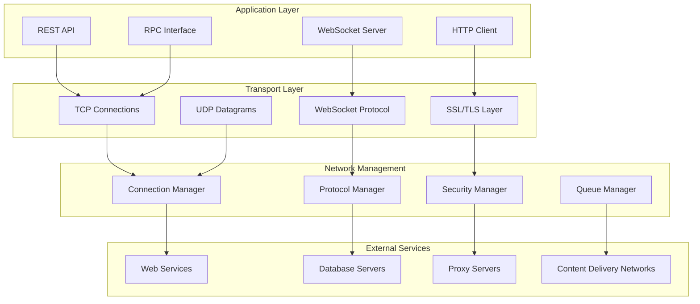

# Phân Tích Network và Communication System

Tài liệu này cung cấp phân tích chi tiết về hệ thống network và communication của BrowserAutomationStudio, bao gồm protocols, security và performance optimization.

## 📋 Mục Lục

- [Network Architecture](#network-architecture)
- [Communication Protocols](#communication-protocols)
- [HTTP Client Implementation](#http-client-implementation)
- [WebSocket Communication](#websocket-communication)
- [Inter-Process Communication](#inter-process-communication)
- [Network Security](#network-security)
- [Performance Optimization](#performance-optimization)

## 🌐 Network Architecture

### Network Layer Architecture



### Advanced Network Manager

```cpp
class NetworkManager : public QObject {
    Q_OBJECT
    
private:
    struct ConnectionContext {
        QString connectionId;
        QNetworkAccessManager* networkManager;
        QNetworkProxy proxy;
        QSslConfiguration sslConfig;
        QDateTime createdAt;
        QDateTime lastUsed;
        int requestCount;
        qint64 totalBytes;
        bool isActive;
        QMutex contextMutex;
    };
    
    struct RequestMetrics {
        QString url;
        QString method;
        qint64 requestTime;
        qint64 responseTime;
        int statusCode;
        qint64 bytesReceived;
        qint64 bytesSent;
        QString errorString;
        QDateTime timestamp;
    };
    
    // Connection management
    QHash<QString, ConnectionContext*> _connections;
    QQueue<ConnectionContext*> _connectionPool;
    QMutex _poolMutex;
    
    // Request tracking
    QHash<QNetworkReply*, RequestMetrics> _activeRequests;
    QList<RequestMetrics> _requestHistory;
    QMutex _metricsMutex;
    
    // Configuration
    NetworkConfig _config;
    QTimer* _cleanupTimer;
    QTimer* _metricsTimer;
    
    // Performance monitoring
    NetworkPerformanceMonitor* _performanceMonitor;
    
public:
    NetworkManager(QObject* parent = nullptr) : QObject(parent) {
        InitializeNetworkManager();
        SetupConnectionPool();
        SetupPerformanceMonitoring();
        SetupCleanupTimers();
    }
    
    QNetworkReply* SendRequest(const NetworkRequest& request) {
        // Get or create connection context
        auto context = AcquireConnection(request.connectionProfile);
        if (!context) {
            throw NetworkException("Failed to acquire network connection");
        }
        
        // Create Qt network request
        QNetworkRequest qtRequest = CreateQtRequest(request);
        
        // Apply security settings
        ApplySecuritySettings(qtRequest, context);
        
        // Apply performance optimizations
        ApplyPerformanceSettings(qtRequest, request);
        
        // Send request
        QNetworkReply* reply = nullptr;
        
        switch (request.method) {
        case HttpMethod::GET:
            reply = context->networkManager->get(qtRequest);
            break;
        case HttpMethod::POST:
            reply = context->networkManager->post(qtRequest, request.body);
            break;
        case HttpMethod::PUT:
            reply = context->networkManager->put(qtRequest, request.body);
            break;
        case HttpMethod::DELETE_:
            reply = context->networkManager->deleteResource(qtRequest);
            break;
        case HttpMethod::HEAD:
            reply = context->networkManager->head(qtRequest);
            break;
        }
        
        if (reply) {
            // Setup request tracking
            SetupRequestTracking(reply, request, context);
            
            // Setup timeout
            SetupRequestTimeout(reply, request.timeoutMs);
            
            // Update context metrics
            UpdateConnectionMetrics(context, request);
        }
        
        return reply;
    }
    
    QFuture<NetworkResponse> SendRequestAsync(const NetworkRequest& request) {
        return QtConcurrent::run([this, request]() -> NetworkResponse {
            QEventLoop eventLoop;
            NetworkResponse response;
            
            auto reply = SendRequest(request);
            if (!reply) {
                response.success = false;
                response.errorString = "Failed to create request";
                return response;
            }
            
            // Connect completion signals
            connect(reply, &QNetworkReply::finished, &eventLoop, &QEventLoop::quit);
            connect(reply, QOverload<QNetworkReply::NetworkError>::of(&QNetworkReply::error),
                    [&response](QNetworkReply::NetworkError error) {
                        response.success = false;
                        response.networkError = error;
                    });
            
            // Wait for completion
            eventLoop.exec();
            
            // Process response
            response = ProcessNetworkReply(reply);
            reply->deleteLater();
            
            return response;
        });
    }
    
private:
    void InitializeNetworkManager() {
        // Set global network settings
        QNetworkProxyFactory::setUseSystemConfiguration(true);
        
        // Configure SSL
        auto sslConfig = QSslConfiguration::defaultConfiguration();
        sslConfig.setProtocol(QSsl::TlsV1_2OrLater);
        sslConfig.setPeerVerifyMode(QSslSocket::VerifyPeer);
        QSslConfiguration::setDefaultConfiguration(sslConfig);
        
        // Load configuration
        LoadNetworkConfiguration();
    }
    
    ConnectionContext* AcquireConnection(const QString& profile) {
        QMutexLocker locker(&_poolMutex);
        
        // Try to find existing connection for profile
        for (auto it = _connections.begin(); it != _connections.end(); ++it) {
            auto context = it.value();
            QMutexLocker contextLocker(&context->contextMutex);
            
            if (it.key() == profile && context->isActive) {
                context->lastUsed = QDateTime::currentDateTime();
                return context;
            }
        }
        
        // Create new connection
        auto context = CreateNewConnection(profile);
        if (context) {
            _connections.insert(profile, context);
        }
        
        return context;
    }
    
    ConnectionContext* CreateNewConnection(const QString& profile) {
        auto context = new ConnectionContext();
        context->connectionId = QUuid::createUuid().toString();
        context->networkManager = new QNetworkAccessManager(this);
        context->createdAt = QDateTime::currentDateTime();
        context->lastUsed = context->createdAt;
        context->requestCount = 0;
        context->totalBytes = 0;
        context->isActive = true;
        
        // Configure network manager
        ConfigureNetworkManager(context, profile);
        
        // Setup signal connections
        SetupNetworkManagerSignals(context);
        
        return context;
    }
    
    void ConfigureNetworkManager(ConnectionContext* context, const QString& profile) {
        auto profileConfig = _config.profiles.value(profile);
        
        // Configure proxy
        if (!profileConfig.proxyHost.isEmpty()) {
            QNetworkProxy proxy;
            proxy.setType(QNetworkProxy::HttpProxy);
            proxy.setHostName(profileConfig.proxyHost);
            proxy.setPort(profileConfig.proxyPort);
            
            if (!profileConfig.proxyUser.isEmpty()) {
                proxy.setUser(profileConfig.proxyUser);
                proxy.setPassword(profileConfig.proxyPassword);
            }
            
            context->networkManager->setProxy(proxy);
            context->proxy = proxy;
        }
        
        // Configure SSL
        if (profileConfig.enableSSL) {
            QSslConfiguration sslConfig;
            sslConfig.setProtocol(QSsl::TlsV1_2OrLater);
            sslConfig.setPeerVerifyMode(profileConfig.verifySSL ? 
                                       QSslSocket::VerifyPeer : 
                                       QSslSocket::VerifyNone);
            
            if (!profileConfig.clientCertPath.isEmpty()) {
                QSslCertificate clientCert = LoadCertificate(profileConfig.clientCertPath);
                QSslKey clientKey = LoadPrivateKey(profileConfig.clientKeyPath);
                sslConfig.setLocalCertificate(clientCert);
                sslConfig.setPrivateKey(clientKey);
            }
            
            context->sslConfig = sslConfig;
        }
        
        // Configure cache
        if (profileConfig.enableCache) {
            auto cache = new QNetworkDiskCache(context->networkManager);
            cache->setCacheDirectory(profileConfig.cacheDirectory);
            cache->setMaximumCacheSize(profileConfig.maxCacheSize);
            context->networkManager->setCache(cache);
        }
        
        // Configure cookie jar
        if (profileConfig.enableCookies) {
            auto cookieJar = new QNetworkCookieJar(context->networkManager);
            context->networkManager->setCookieJar(cookieJar);
        }
    }
    
    void SetupRequestTracking(QNetworkReply* reply, const NetworkRequest& request, 
                             ConnectionContext* context) {
        RequestMetrics metrics;
        metrics.url = request.url.toString();
        metrics.method = HttpMethodToString(request.method);
        metrics.requestTime = QDateTime::currentMSecsSinceEpoch();
        metrics.timestamp = QDateTime::currentDateTime();
        
        QMutexLocker locker(&_metricsMutex);
        _activeRequests.insert(reply, metrics);
        
        // Connect signals for tracking
        connect(reply, &QNetworkReply::finished, [this, reply, context]() {
            HandleRequestFinished(reply, context);
        });
        
        connect(reply, &QNetworkReply::downloadProgress, 
                [this, reply](qint64 received, qint64 total) {
                    HandleDownloadProgress(reply, received, total);
                });
        
        connect(reply, &QNetworkReply::uploadProgress,
                [this, reply](qint64 sent, qint64 total) {
                    HandleUploadProgress(reply, sent, total);
                });
        
        connect(reply, QOverload<QNetworkReply::NetworkError>::of(&QNetworkReply::error),
                [this, reply](QNetworkReply::NetworkError error) {
                    HandleNetworkError(reply, error);
                });
    }
    
    void HandleRequestFinished(QNetworkReply* reply, ConnectionContext* context) {
        QMutexLocker metricsLocker(&_metricsMutex);
        
        auto it = _activeRequests.find(reply);
        if (it == _activeRequests.end()) {
            return;
        }
        
        RequestMetrics& metrics = it.value();
        metrics.responseTime = QDateTime::currentMSecsSinceEpoch();
        metrics.statusCode = reply->attribute(QNetworkRequest::HttpStatusCodeAttribute).toInt();
        metrics.bytesReceived = reply->bytesAvailable();
        
        if (reply->error() != QNetworkReply::NoError) {
            metrics.errorString = reply->errorString();
        }
        
        // Move to history
        _requestHistory.append(metrics);
        _activeRequests.erase(it);
        
        // Limit history size
        if (_requestHistory.size() > _config.maxHistorySize) {
            _requestHistory.removeFirst();
        }
        
        metricsLocker.unlock();
        
        // Update context metrics
        QMutexLocker contextLocker(&context->contextMutex);
        context->requestCount++;
        context->totalBytes += metrics.bytesReceived;
        context->lastUsed = QDateTime::currentDateTime();
        
        // Update performance monitor
        _performanceMonitor->RecordRequest(metrics);
        
        emit RequestCompleted(reply, metrics);
    }
    
    NetworkResponse ProcessNetworkReply(QNetworkReply* reply) {
        NetworkResponse response;
        
        response.statusCode = reply->attribute(QNetworkRequest::HttpStatusCodeAttribute).toInt();
        response.data = reply->readAll();
        response.success = (reply->error() == QNetworkReply::NoError);
        response.errorString = reply->errorString();
        response.networkError = reply->error();
        
        // Process headers
        for (const auto& headerPair : reply->rawHeaderPairs()) {
            response.headers.insert(QString::fromUtf8(headerPair.first),
                                  QString::fromUtf8(headerPair.second));
        }
        
        // Calculate timing
        auto requestTime = reply->property("requestTime").toLongLong();
        if (requestTime > 0) {
            response.elapsedTime = QDateTime::currentMSecsSinceEpoch() - requestTime;
        }
        
        return response;
    }
    
signals:
    void RequestCompleted(QNetworkReply* reply, const RequestMetrics& metrics);
    void ConnectionCreated(const QString& connectionId);
    void ConnectionClosed(const QString& connectionId);
    void NetworkError(const QString& error);
};
```

## 🔌 WebSocket Communication

### WebSocket Server Implementation

```cpp
class WebSocketServer : public QObject {
    Q_OBJECT
    
private:
    struct ClientConnection {
        QString clientId;
        QWebSocket* socket;
        QDateTime connectedAt;
        QDateTime lastActivity;
        QString userAgent;
        QString origin;
        QStringList subscribedChannels;
        bool isAuthenticated;
        QString userId;
        QJsonObject metadata;
    };
    
    QWebSocketServer* _server;
    QHash<QWebSocket*, ClientConnection*> _clients;
    QHash<QString, QList<ClientConnection*>> _channels;
    QMutex _clientsMutex;
    
    // Message handling
    QHash<QString, std::function<void(ClientConnection*, const QJsonObject&)>> _messageHandlers;
    QQueue<QJsonObject> _messageQueue;
    QMutex _queueMutex;
    
    // Security
    QSet<QString> _allowedOrigins;
    QTimer* _heartbeatTimer;
    int _maxConnections;
    int _heartbeatInterval;
    
public:
    WebSocketServer(quint16 port, QObject* parent = nullptr) : QObject(parent) {
        _server = new QWebSocketServer("BAS WebSocket Server", 
                                      QWebSocketServer::NonSecureMode, this);
        
        InitializeMessageHandlers();
        SetupSecurity();
        
        if (_server->listen(QHostAddress::Any, port)) {
            connect(_server, &QWebSocketServer::newConnection,
                    this, &WebSocketServer::OnNewConnection);
            
            qDebug() << "WebSocket server listening on port" << port;
        } else {
            qWarning() << "Failed to start WebSocket server:" << _server->errorString();
        }
        
        SetupHeartbeat();
    }
    
    void BroadcastMessage(const QString& channel, const QJsonObject& message) {
        QMutexLocker locker(&_clientsMutex);
        
        auto clients = _channels.value(channel);
        for (auto client : clients) {
            if (client->socket && client->socket->state() == QAbstractSocket::ConnectedState) {
                SendMessage(client, message);
            }
        }
    }
    
    void SendMessageToClient(const QString& clientId, const QJsonObject& message) {
        QMutexLocker locker(&_clientsMutex);
        
        for (auto it = _clients.begin(); it != _clients.end(); ++it) {
            if (it.value()->clientId == clientId) {
                SendMessage(it.value(), message);
                break;
            }
        }
    }
    
private slots:
    void OnNewConnection() {
        while (_server->hasPendingConnections()) {
            auto socket = _server->nextPendingConnection();
            
            // Check connection limits
            if (_clients.size() >= _maxConnections) {
                qWarning() << "Connection limit reached, rejecting connection";
                socket->close(QWebSocketProtocol::CloseCodeTryAgainLater, 
                             "Server at capacity");
                socket->deleteLater();
                continue;
            }
            
            // Validate origin
            if (!IsOriginAllowed(socket->origin())) {
                qWarning() << "Rejecting connection from disallowed origin:" << socket->origin();
                socket->close(QWebSocketProtocol::CloseCodePolicyViolated,
                             "Origin not allowed");
                socket->deleteLater();
                continue;
            }
            
            // Create client connection
            auto client = new ClientConnection();
            client->clientId = QUuid::createUuid().toString();
            client->socket = socket;
            client->connectedAt = QDateTime::currentDateTime();
            client->lastActivity = client->connectedAt;
            client->userAgent = socket->requestHeader("User-Agent");
            client->origin = socket->origin();
            client->isAuthenticated = false;
            
            QMutexLocker locker(&_clientsMutex);
            _clients.insert(socket, client);
            locker.unlock();
            
            // Setup socket signals
            connect(socket, &QWebSocket::textMessageReceived,
                    [this, client](const QString& message) {
                        HandleTextMessage(client, message);
                    });
            
            connect(socket, &QWebSocket::binaryMessageReceived,
                    [this, client](const QByteArray& message) {
                        HandleBinaryMessage(client, message);
                    });
            
            connect(socket, &QWebSocket::disconnected,
                    [this, client]() {
                        HandleClientDisconnected(client);
                    });
            
            connect(socket, QOverload<QAbstractSocket::SocketError>::of(&QWebSocket::error),
                    [this, client](QAbstractSocket::SocketError error) {
                        HandleSocketError(client, error);
                    });
            
            qDebug() << "New WebSocket connection:" << client->clientId 
                     << "from" << socket->peerAddress().toString();
            
            // Send welcome message
            QJsonObject welcomeMessage;
            welcomeMessage["type"] = "welcome";
            welcomeMessage["clientId"] = client->clientId;
            welcomeMessage["serverTime"] = QDateTime::currentDateTime().toString(Qt::ISODate);
            SendMessage(client, welcomeMessage);
            
            emit ClientConnected(client->clientId);
        }
    }
    
    void HandleTextMessage(ClientConnection* client, const QString& message) {
        client->lastActivity = QDateTime::currentDateTime();
        
        // Parse JSON message
        QJsonParseError error;
        auto doc = QJsonDocument::fromJson(message.toUtf8(), &error);
        
        if (error.error != QJsonParseError::NoError) {
            QJsonObject errorResponse;
            errorResponse["type"] = "error";
            errorResponse["message"] = "Invalid JSON: " + error.errorString();
            SendMessage(client, errorResponse);
            return;
        }
        
        auto messageObj = doc.object();
        QString messageType = messageObj["type"].toString();
        
        // Handle message based on type
        auto handler = _messageHandlers.value(messageType);
        if (handler) {
            try {
                handler(client, messageObj);
            } catch (const std::exception& e) {
                QJsonObject errorResponse;
                errorResponse["type"] = "error";
                errorResponse["message"] = QString("Handler error: %1").arg(e.what());
                SendMessage(client, errorResponse);
            }
        } else {
            QJsonObject errorResponse;
            errorResponse["type"] = "error";
            errorResponse["message"] = "Unknown message type: " + messageType;
            SendMessage(client, errorResponse);
        }
    }
    
    void InitializeMessageHandlers() {
        // Authentication handler
        _messageHandlers["authenticate"] = [this](ClientConnection* client, const QJsonObject& message) {
            QString token = message["token"].toString();
            if (ValidateAuthToken(token)) {
                client->isAuthenticated = true;
                client->userId = ExtractUserIdFromToken(token);
                
                QJsonObject response;
                response["type"] = "authenticated";
                response["userId"] = client->userId;
                SendMessage(client, response);
            } else {
                QJsonObject response;
                response["type"] = "authentication_failed";
                response["message"] = "Invalid token";
                SendMessage(client, response);
            }
        };
        
        // Channel subscription handler
        _messageHandlers["subscribe"] = [this](ClientConnection* client, const QJsonObject& message) {
            QString channel = message["channel"].toString();
            
            if (!client->isAuthenticated && RequiresAuthentication(channel)) {
                QJsonObject response;
                response["type"] = "error";
                response["message"] = "Authentication required for channel: " + channel;
                SendMessage(client, response);
                return;
            }
            
            SubscribeToChannel(client, channel);
            
            QJsonObject response;
            response["type"] = "subscribed";
            response["channel"] = channel;
            SendMessage(client, response);
        };
        
        // Channel unsubscription handler
        _messageHandlers["unsubscribe"] = [this](ClientConnection* client, const QJsonObject& message) {
            QString channel = message["channel"].toString();
            UnsubscribeFromChannel(client, channel);
            
            QJsonObject response;
            response["type"] = "unsubscribed";
            response["channel"] = channel;
            SendMessage(client, response);
        };
        
        // Ping handler
        _messageHandlers["ping"] = [this](ClientConnection* client, const QJsonObject& message) {
            QJsonObject response;
            response["type"] = "pong";
            response["timestamp"] = QDateTime::currentMSecsSinceEpoch();
            SendMessage(client, response);
        };
        
        // Script execution status handler
        _messageHandlers["script_status"] = [this](ClientConnection* client, const QJsonObject& message) {
            if (!client->isAuthenticated) {
                SendAuthenticationRequired(client);
                return;
            }
            
            QString scriptId = message["scriptId"].toString();
            auto status = GetScriptExecutionStatus(scriptId);
            
            QJsonObject response;
            response["type"] = "script_status_response";
            response["scriptId"] = scriptId;
            response["status"] = status;
            SendMessage(client, response);
        };
    }
    
    void SendMessage(ClientConnection* client, const QJsonObject& message) {
        if (!client->socket || client->socket->state() != QAbstractSocket::ConnectedState) {
            return;
        }
        
        QJsonDocument doc(message);
        client->socket->sendTextMessage(doc.toJson(QJsonDocument::Compact));
    }
    
    void SubscribeToChannel(ClientConnection* client, const QString& channel) {
        QMutexLocker locker(&_clientsMutex);
        
        if (!client->subscribedChannels.contains(channel)) {
            client->subscribedChannels.append(channel);
            _channels[channel].append(client);
        }
    }
    
    void UnsubscribeFromChannel(ClientConnection* client, const QString& channel) {
        QMutexLocker locker(&_clientsMutex);
        
        client->subscribedChannels.removeAll(channel);
        _channels[channel].removeAll(client);
        
        if (_channels[channel].isEmpty()) {
            _channels.remove(channel);
        }
    }
    
signals:
    void ClientConnected(const QString& clientId);
    void ClientDisconnected(const QString& clientId);
    void MessageReceived(const QString& clientId, const QJsonObject& message);
};
```

---

*Tài liệu này tiếp tục với các phần về Inter-Process Communication, Network Security và Performance Optimization.*
