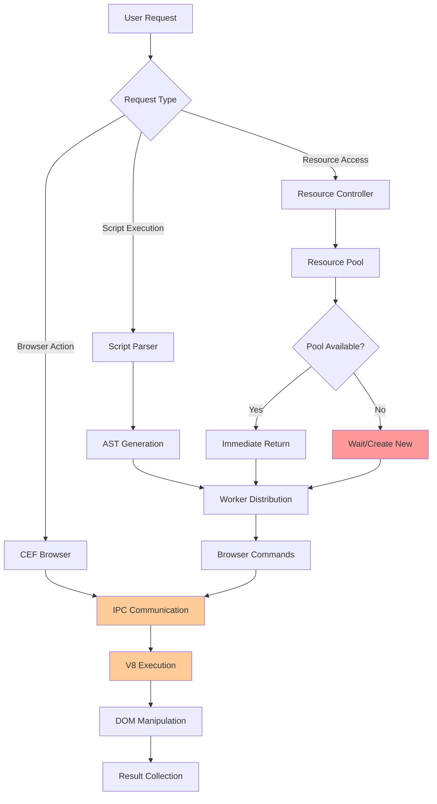

# Phân Tích Hiệu Năng Chi Tiết

Tài liệu này cung cấp phân tích sâu về hiệu năng của BrowserAutomationStudio, bao gồm các điểm nghẽn, tối ưu hóa và monitoring.

## 📋 Mục Lục

- [Phân Tích Kiến Trúc Hiệu Năng](#phân-tích-kiến-trúc-hiệu-năng)
- [Memory Management](#memory-management)
- [Threading và Concurrency](#threading-và-concurrency)
- [Browser Performance](#browser-performance)
- [Database Performance](#database-performance)
- [Network Performance](#network-performance)
- [Profiling và Monitoring](#profiling-và-monitoring)

## 🏗️ Phân Tích Kiến Trúc Hiệu Năng

### Performance Bottlenecks Identification



### Critical Performance Paths

#### 1. Script Compilation Path
```cpp
class PerformanceOptimizedCompiler {
private:
    // AST caching for repeated scripts
    QCache<QString, ScriptAST> _astCache;
    
    // Compilation metrics
    struct CompilationMetrics {
        qint64 parseTime;
        qint64 validationTime;
        qint64 optimizationTime;
        int astNodeCount;
    };
    
public:
    ScriptAST* CompileScript(const QString& script) {
        QElapsedTimer timer;
        timer.start();
        
        // Check cache first
        QString scriptHash = QCryptographicHash::hash(script.toUtf8(), 
                                                     QCryptographicHash::Md5).toHex();
        
        if (auto cached = _astCache.object(scriptHash)) {
            qDebug() << "AST cache hit, compilation time:" << timer.elapsed() << "ms";
            return cached;
        }
        
        // Parse script
        qint64 parseStart = timer.elapsed();
        auto ast = ParseScript(script);
        qint64 parseTime = timer.elapsed() - parseStart;
        
        // Validate
        qint64 validationStart = timer.elapsed();
        ValidateAST(ast);
        qint64 validationTime = timer.elapsed() - validationStart;
        
        // Optimize
        qint64 optimizationStart = timer.elapsed();
        OptimizeAST(ast);
        qint64 optimizationTime = timer.elapsed() - optimizationStart;
        
        // Cache result
        _astCache.insert(scriptHash, ast, ast->GetMemorySize());
        
        // Log metrics
        CompilationMetrics metrics{parseTime, validationTime, optimizationTime, ast->GetNodeCount()};
        LogCompilationMetrics(metrics);
        
        return ast;
    }
    
private:
    void OptimizeAST(ScriptAST* ast) {
        // Dead code elimination
        RemoveUnreachableCode(ast);
        
        // Constant folding
        FoldConstants(ast);
        
        // Loop optimization
        OptimizeLoops(ast);
        
        // Function inlining for small functions
        InlineSmallFunctions(ast);
    }
};
```

#### 2. Resource Access Optimization
```cpp
class HighPerformanceResourceController {
private:
    // Multi-level caching
    struct CacheLevel {
        QCache<QString, QString> l1Cache;  // Hot data
        QCache<QString, QString> l2Cache;  // Warm data
        QTimer* evictionTimer;
    };
    
    CacheLevel _cache;
    
    // Connection pooling for database resources
    QHash<QString, QQueue<QSqlDatabase*>> _connectionPools;
    QMutex _poolMutex;
    
    // Async loading
    QThreadPool* _loaderThreadPool;
    QHash<QString, QFuture<QString>> _pendingLoads;
    
public:
    QString GetResource(const QString& name, int workerId) override {
        // L1 cache check (fastest)
        if (auto value = _cache.l1Cache.object(name)) {
            RecordCacheHit(CacheLevel::L1);
            return *value;
        }
        
        // L2 cache check
        if (auto value = _cache.l2Cache.object(name)) {
            // Promote to L1
            _cache.l1Cache.insert(name, new QString(*value));
            RecordCacheHit(CacheLevel::L2);
            return *value;
        }
        
        // Check if already loading
        if (_pendingLoads.contains(name)) {
            auto future = _pendingLoads.value(name);
            return future.result(); // Wait for completion
        }
        
        // Load asynchronously
        auto future = QtConcurrent::run(_loaderThreadPool, [this, name]() {
            return LoadResourceFromSource(name);
        });
        
        _pendingLoads.insert(name, future);
        QString result = future.result();
        _pendingLoads.remove(name);
        
        // Cache the result
        _cache.l2Cache.insert(name, new QString(result));
        
        return result;
    }
    
private:
    QString LoadResourceFromSource(const QString& name) {
        auto handler = GetResourceHandler(name);
        
        if (auto dbHandler = qobject_cast<DatabaseResourceHandler*>(handler)) {
            return LoadFromDatabaseOptimized(dbHandler);
        } else if (auto fileHandler = qobject_cast<FileResourceHandler*>(handler)) {
            return LoadFromFileOptimized(fileHandler);
        }
        
        return handler->GetValue();
    }
    
    QString LoadFromDatabaseOptimized(DatabaseResourceHandler* handler) {
        // Use connection pooling
        QMutexLocker locker(&_poolMutex);
        
        QString connectionKey = handler->GetConnectionString();
        auto& pool = _connectionPools[connectionKey];
        
        QSqlDatabase* db = nullptr;
        if (!pool.isEmpty()) {
            db = pool.dequeue();
        } else {
            db = new QSqlDatabase(QSqlDatabase::addDatabase("QSQLITE", 
                                  QString("conn_%1").arg(QThread::currentThreadId())));
            db->setDatabaseName(handler->GetDatabasePath());
            db->open();
        }
        
        locker.unlock();
        
        // Execute query with prepared statement
        QSqlQuery query(*db);
        query.prepare(handler->GetQuery());
        
        QString result;
        if (query.exec() && query.next()) {
            result = query.value(0).toString();
        }
        
        // Return connection to pool
        locker.relock();
        pool.enqueue(db);
        
        return result;
    }
};
```

## 🧠 Memory Management

### Memory Pool Implementation

```cpp
template<typename T, size_t PoolSize = 1024>
class MemoryPool {
private:
    struct Block {
        alignas(T) char data[sizeof(T)];
        Block* next;
    };
    
    Block _pool[PoolSize];
    Block* _freeList;
    std::atomic<size_t> _allocatedCount{0};
    std::mutex _mutex;
    
public:
    MemoryPool() {
        // Initialize free list
        for (size_t i = 0; i < PoolSize - 1; ++i) {
            _pool[i].next = &_pool[i + 1];
        }
        _pool[PoolSize - 1].next = nullptr;
        _freeList = &_pool[0];
    }
    
    T* Allocate() {
        std::lock_guard<std::mutex> lock(_mutex);
        
        if (!_freeList) {
            // Pool exhausted, fall back to heap allocation
            _allocatedCount++;
            return static_cast<T*>(std::malloc(sizeof(T)));
        }
        
        Block* block = _freeList;
        _freeList = _freeList->next;
        _allocatedCount++;
        
        return reinterpret_cast<T*>(block);
    }
    
    void Deallocate(T* ptr) {
        std::lock_guard<std::mutex> lock(_mutex);
        
        // Check if pointer is from pool
        if (ptr >= reinterpret_cast<T*>(&_pool[0]) && 
            ptr < reinterpret_cast<T*>(&_pool[PoolSize])) {
            
            Block* block = reinterpret_cast<Block*>(ptr);
            block->next = _freeList;
            _freeList = block;
        } else {
            // Heap allocated
            std::free(ptr);
        }
        
        _allocatedCount--;
    }
    
    size_t GetAllocatedCount() const { return _allocatedCount.load(); }
    size_t GetPoolUtilization() const { 
        return (_allocatedCount.load() * 100) / PoolSize; 
    }
};

// Global memory pools for common objects
MemoryPool<BrowserCommand> g_browserCommandPool;
MemoryPool<ResourceRequest> g_resourceRequestPool;
MemoryPool<ScriptNode> g_scriptNodePool;
```

### Smart Pointer Usage Analysis

```cpp
// RAII wrapper for CEF objects
template<typename T>
class CefPtr {
private:
    CefRefPtr<T> _ptr;
    
public:
    explicit CefPtr(T* ptr) : _ptr(ptr) {}
    CefPtr(const CefPtr&) = delete;
    CefPtr& operator=(const CefPtr&) = delete;
    
    CefPtr(CefPtr&& other) noexcept : _ptr(std::move(other._ptr)) {}
    CefPtr& operator=(CefPtr&& other) noexcept {
        _ptr = std::move(other._ptr);
        return *this;
    }
    
    T* Get() const { return _ptr.get(); }
    T* operator->() const { return _ptr.get(); }
    T& operator*() const { return *_ptr.get(); }
    
    explicit operator bool() const { return _ptr != nullptr; }
};

// Memory-efficient resource management
class ResourceManager {
private:
    // Use weak references to avoid circular dependencies
    QHash<QString, QWeakPointer<Resource>> _resourceCache;
    
    // Memory pressure monitoring
    QTimer* _memoryMonitor;
    size_t _memoryThreshold;
    
public:
    QSharedPointer<Resource> GetResource(const QString& name) {
        // Check cache first
        auto weakPtr = _resourceCache.value(name);
        if (auto sharedPtr = weakPtr.toStrongRef()) {
            return sharedPtr;
        }
        
        // Create new resource
        auto resource = QSharedPointer<Resource>::create(name);
        _resourceCache.insert(name, resource.toWeakRef());
        
        // Check memory pressure
        CheckMemoryPressure();
        
        return resource;
    }
    
private:
    void CheckMemoryPressure() {
        size_t currentMemory = GetCurrentMemoryUsage();
        if (currentMemory > _memoryThreshold) {
            // Trigger garbage collection
            CleanupExpiredResources();
            
            // If still over threshold, force cleanup
            if (GetCurrentMemoryUsage() > _memoryThreshold) {
                ForceResourceCleanup();
            }
        }
    }
    
    void CleanupExpiredResources() {
        auto it = _resourceCache.begin();
        while (it != _resourceCache.end()) {
            if (it.value().isNull()) {
                it = _resourceCache.erase(it);
            } else {
                ++it;
            }
        }
    }
};
```

## 🧵 Threading và Concurrency

### Thread Pool Optimization

```cpp
class AdaptiveThreadPool {
private:
    QThreadPool* _threadPool;
    QQueue<QRunnable*> _highPriorityQueue;
    QQueue<QRunnable*> _normalPriorityQueue;
    QQueue<QRunnable*> _lowPriorityQueue;
    
    QMutex _queueMutex;
    QWaitCondition _taskAvailable;
    
    // Performance metrics
    std::atomic<int> _activeTasks{0};
    std::atomic<int> _queuedTasks{0};
    QElapsedTimer _performanceTimer;
    
    // Adaptive scaling
    QTimer* _scalingTimer;
    double _targetUtilization = 0.8;
    
public:
    AdaptiveThreadPool(QObject* parent = nullptr) : QObject(parent) {
        _threadPool = new QThreadPool(this);
        _threadPool->setMaxThreadCount(QThread::idealThreadCount());
        
        // Setup adaptive scaling
        _scalingTimer = new QTimer(this);
        connect(_scalingTimer, &QTimer::timeout, this, &AdaptiveThreadPool::AdjustThreadCount);
        _scalingTimer->start(5000); // Check every 5 seconds
        
        _performanceTimer.start();
    }
    
    void SubmitTask(QRunnable* task, TaskPriority priority = Normal) {
        QMutexLocker locker(&_queueMutex);
        
        switch (priority) {
        case High:
            _highPriorityQueue.enqueue(task);
            break;
        case Normal:
            _normalPriorityQueue.enqueue(task);
            break;
        case Low:
            _lowPriorityQueue.enqueue(task);
            break;
        }
        
        _queuedTasks++;
        _taskAvailable.wakeOne();
        
        // Try to start task immediately if threads available
        TryStartNextTask();
    }
    
private:
    void TryStartNextTask() {
        if (_threadPool->activeThreadCount() < _threadPool->maxThreadCount()) {
            QRunnable* task = GetNextTask();
            if (task) {
                _threadPool->start(new TaskWrapper(task, this));
                _activeTasks++;
                _queuedTasks--;
            }
        }
    }
    
    QRunnable* GetNextTask() {
        // Priority-based task selection
        if (!_highPriorityQueue.isEmpty()) {
            return _highPriorityQueue.dequeue();
        }
        if (!_normalPriorityQueue.isEmpty()) {
            return _normalPriorityQueue.dequeue();
        }
        if (!_lowPriorityQueue.isEmpty()) {
            return _lowPriorityQueue.dequeue();
        }
        return nullptr;
    }
    
    void AdjustThreadCount() {
        double utilization = CalculateUtilization();
        int currentThreads = _threadPool->maxThreadCount();
        int idealThreads = currentThreads;
        
        if (utilization > _targetUtilization && _queuedTasks > 0) {
            // Increase threads if we have queued tasks and high utilization
            idealThreads = qMin(currentThreads + 1, QThread::idealThreadCount() * 2);
        } else if (utilization < _targetUtilization * 0.5) {
            // Decrease threads if utilization is low
            idealThreads = qMax(currentThreads - 1, QThread::idealThreadCount() / 2);
        }
        
        if (idealThreads != currentThreads) {
            _threadPool->setMaxThreadCount(idealThreads);
            qDebug() << "Adjusted thread count from" << currentThreads << "to" << idealThreads
                     << "utilization:" << utilization;
        }
    }
    
    double CalculateUtilization() {
        int activeThreads = _threadPool->activeThreadCount();
        int maxThreads = _threadPool->maxThreadCount();
        return maxThreads > 0 ? static_cast<double>(activeThreads) / maxThreads : 0.0;
    }
};
```

### Lock-Free Data Structures

```cpp
// Lock-free queue for high-performance task distribution
template<typename T>
class LockFreeQueue {
private:
    struct Node {
        std::atomic<T*> data{nullptr};
        std::atomic<Node*> next{nullptr};
    };
    
    std::atomic<Node*> _head;
    std::atomic<Node*> _tail;
    
public:
    LockFreeQueue() {
        Node* dummy = new Node;
        _head.store(dummy);
        _tail.store(dummy);
    }
    
    void Enqueue(T* item) {
        Node* newNode = new Node;
        newNode->data.store(item);
        
        Node* prevTail = _tail.exchange(newNode);
        prevTail->next.store(newNode);
    }
    
    T* Dequeue() {
        Node* head = _head.load();
        Node* next = head->next.load();
        
        if (next == nullptr) {
            return nullptr; // Queue is empty
        }
        
        T* data = next->data.load();
        _head.store(next);
        delete head;
        
        return data;
    }
    
    bool IsEmpty() const {
        Node* head = _head.load();
        Node* next = head->next.load();
        return next == nullptr;
    }
};

// Usage in high-performance scenarios
class HighThroughputTaskDispatcher {
private:
    LockFreeQueue<BrowserTask> _taskQueue;
    std::vector<std::thread> _workerThreads;
    std::atomic<bool> _running{true};
    
public:
    HighThroughputTaskDispatcher(int numWorkers) {
        for (int i = 0; i < numWorkers; ++i) {
            _workerThreads.emplace_back([this]() {
                WorkerLoop();
            });
        }
    }
    
    void SubmitTask(BrowserTask* task) {
        _taskQueue.Enqueue(task);
    }
    
private:
    void WorkerLoop() {
        while (_running.load()) {
            if (auto task = _taskQueue.Dequeue()) {
                ProcessTask(task);
                delete task;
            } else {
                // No tasks available, yield CPU
                std::this_thread::yield();
            }
        }
    }
};
```

## 🌐 Browser Performance

### CEF Optimization Settings

```cpp
class OptimizedCEFManager {
private:
    struct BrowserMetrics {
        qint64 loadTime;
        qint64 renderTime;
        size_t memoryUsage;
        int jsExecutionTime;
    };
    
    QHash<int, BrowserMetrics> _browserMetrics;
    
public:
    void InitializeCEF() {
        CefSettings settings;
        
        // Performance optimizations
        settings.multi_threaded_message_loop = true;
        settings.external_message_pump = false;
        
        // Memory optimizations
        settings.uncaught_exception_stack_size = 0;
        settings.pack_loading_disabled = false;
        
        // Disable unnecessary features
        CefString(&settings.user_agent).FromString(
            "BAS/1.0 (Windows NT 10.0; Win64; x64) Chrome/90.0.4430.212");
        
        // Cache settings for performance
        CefString(&settings.cache_path).FromString("cache");
        settings.persist_session_cookies = false;
        settings.persist_user_preferences = false;
        
        // Resource optimization
        settings.background_color = 0x00000000; // Transparent
        
        CefInitialize(settings, nullptr, nullptr);
    }
    
    CefBrowserSettings GetOptimizedBrowserSettings() {
        CefBrowserSettings settings;
        
        // Disable resource-intensive features
        settings.plugins = STATE_DISABLED;
        settings.java = STATE_DISABLED;
        settings.application_cache = STATE_DISABLED;
        settings.databases = STATE_DISABLED;
        settings.webgl = STATE_DISABLED;
        
        // Enable only necessary features
        settings.local_storage = STATE_ENABLED;
        settings.session_storage = STATE_ENABLED;
        settings.javascript = STATE_ENABLED;
        settings.javascript_close_windows = STATE_DISABLED;
        settings.javascript_access_clipboard = STATE_DISABLED;
        
        // Performance settings
        settings.animation_frame_rate = 30; // Reduce from 60fps
        settings.background_color = 0x00FFFFFF;
        
        return settings;
    }
    
    void OptimizeBrowserForAutomation(CefRefPtr<CefBrowser> browser) {
        // Inject performance optimization script
        QString optimizationScript = R"(
            // Disable animations for faster execution
            var style = document.createElement('style');
            style.innerHTML = `
                *, *::before, *::after {
                    animation-duration: 0.01ms !important;
                    animation-delay: 0.01ms !important;
                    transition-duration: 0.01ms !important;
                    transition-delay: 0.01ms !important;
                }
            `;
            document.head.appendChild(style);
            
            // Disable image loading for faster page loads
            if (window.BAS_DISABLE_IMAGES) {
                var images = document.querySelectorAll('img');
                images.forEach(img => img.style.display = 'none');
            }
            
            // Optimize scroll behavior
            document.documentElement.style.scrollBehavior = 'auto';
        )";
        
        browser->GetMainFrame()->ExecuteJavaScript(
            optimizationScript.toStdString(), "", 0);
    }
};
```

### JavaScript Execution Optimization

```cpp
class OptimizedV8Handler : public CefV8Handler {
private:
    // Function call caching
    QCache<QString, CefV8Value> _functionCache;
    
    // Performance monitoring
    QHash<QString, qint64> _functionExecutionTimes;
    
public:
    bool Execute(const CefString& name,
                CefRefPtr<CefV8Value> object,
                const CefV8ValueList& arguments,
                CefRefPtr<CefV8Value>& retval,
                CefString& exception) override {
        
        QElapsedTimer timer;
        timer.start();
        
        QString functionName = QString::fromStdString(name.ToString());
        
        // Check if function result can be cached
        if (IsCacheable(functionName, arguments)) {
            QString cacheKey = GenerateCacheKey(functionName, arguments);
            if (auto cached = _functionCache.object(cacheKey)) {
                retval = *cached;
                return true;
            }
        }
        
        // Execute function
        bool result = ExecuteFunction(functionName, object, arguments, retval, exception);
        
        // Record execution time
        qint64 executionTime = timer.elapsed();
        _functionExecutionTimes[functionName] = executionTime;
        
        // Cache result if appropriate
        if (result && IsCacheable(functionName, arguments)) {
            QString cacheKey = GenerateCacheKey(functionName, arguments);
            _functionCache.insert(cacheKey, new CefV8Value(retval));
        }
        
        // Log slow functions
        if (executionTime > 100) { // 100ms threshold
            qWarning() << "Slow V8 function execution:" << functionName 
                      << "took" << executionTime << "ms";
        }
        
        return result;
    }
    
private:
    bool IsCacheable(const QString& functionName, const CefV8ValueList& arguments) {
        // Only cache pure functions with primitive arguments
        static QSet<QString> cacheableFunctions = {
            "get_text", "get_attribute", "is_visible", "get_value"
        };
        
        if (!cacheableFunctions.contains(functionName)) {
            return false;
        }
        
        // Check if all arguments are primitive
        for (const auto& arg : arguments) {
            if (!arg->IsString() && !arg->IsInt() && !arg->IsBool()) {
                return false;
            }
        }
        
        return true;
    }
    
    QString GenerateCacheKey(const QString& functionName, const CefV8ValueList& arguments) {
        QStringList parts;
        parts << functionName;
        
        for (const auto& arg : arguments) {
            if (arg->IsString()) {
                parts << arg->GetStringValue().c_str();
            } else if (arg->IsInt()) {
                parts << QString::number(arg->GetIntValue());
            } else if (arg->IsBool()) {
                parts << (arg->GetBoolValue() ? "true" : "false");
            }
        }
        
        return parts.join("|");
    }
};
```

---

*Tài liệu này tiếp tục với các phần phân tích database performance, network performance và monitoring tools.*
