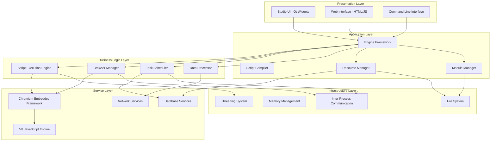
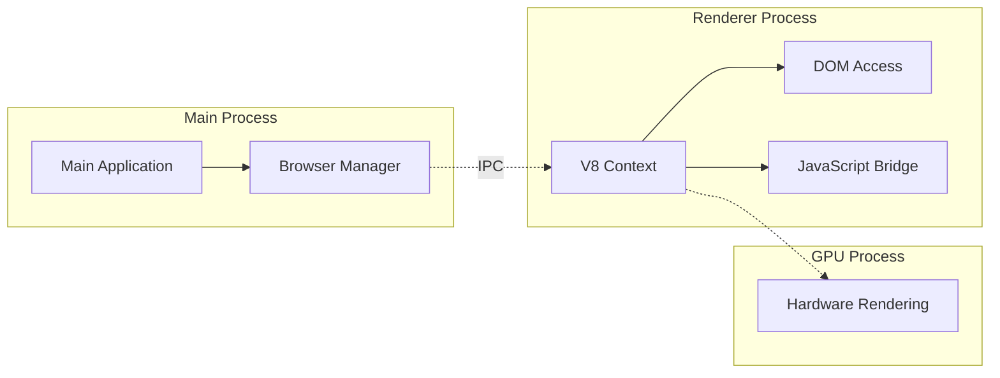
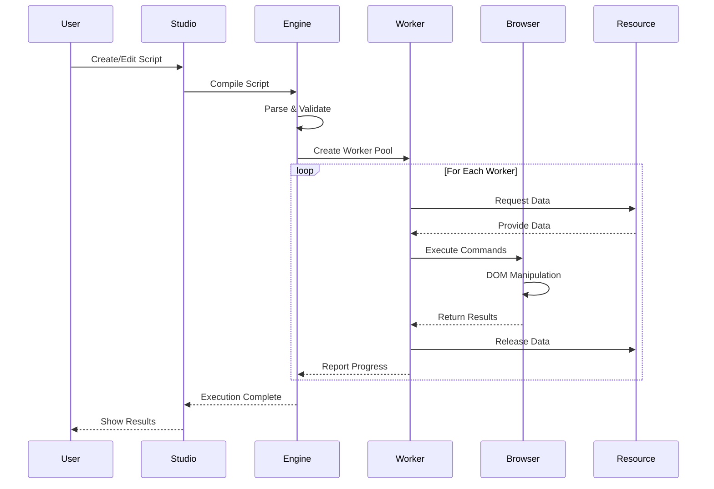
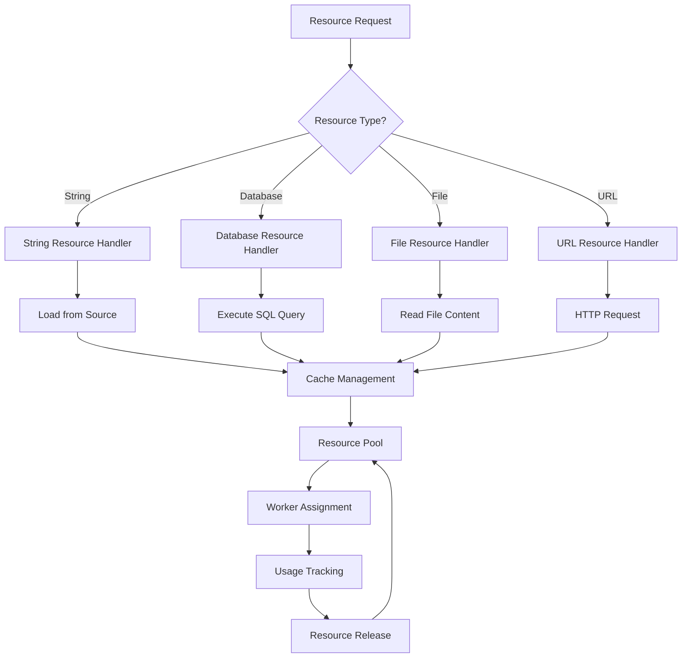

# Phân Tích Kỹ Thuật Chi Tiết - BrowserAutomationStudio

Tài liệu này cung cấp phân tích kỹ thuật sâu về kiến trúc, thiết kế và triển khai của BrowserAutomationStudio.

## 📋 Mục Lục

- [Tổng Quan Kiến Trúc Kỹ Thuật](#tổng-quan-kiến-trúc-kỹ-thuật)
- [Phân Tích Luồng Dữ Liệu](#phân-tích-luồng-dữ-liệu)
- [Phân Tích Hiệu Năng](#phân-tích-hiệu-năng)
- [Phân Tích Bảo Mật](#phân-tích-bảo-mật)
- [Phân Tích Khả Năng Mở Rộng](#phân-tích-khả-năng-mở-rộng)
- [Phân Tích Điểm Yếu](#phân-tích-điểm-yếu)

## 🏗️ Tổng Quan Kiến Trúc Kỹ Thuật

### Kiến Trúc Tổng Thể



### Phân Tích Các Lớp Kiến Trúc

#### 1. Presentation Layer (Lớp Giao Diện)
**Công nghệ**: Qt Widgets, HTML/CSS/JavaScript, Command Line
**Trách nhiệm**:
- Giao diện người dùng chính (Studio)
- Giao diện web cho scheduler
- Command line tools

**Đặc điểm kỹ thuật**:
```cpp
// Qt-based UI với Model-View architecture
class MainWindow : public QMainWindow {
    Q_OBJECT
private:
    // MVC pattern implementation
    QAbstractItemModel* _projectModel;
    QTreeView* _projectView;
    QTextEdit* _scriptEditor;
    
    // Component integration
    Engine* _engine;
    ResourceController* _resourceController;
    ModuleManager* _moduleManager;
};
```

#### 2. Application Layer (Lớp Ứng Dụng)
**Công nghệ**: C++ với Qt Framework
**Trách nhiệm**:
- Điều phối các thành phần hệ thống
- Quản lý vòng đời ứng dụng
- Xử lý logic nghiệp vụ cấp cao

**Phân tích Engine Framework**:
```cpp
// Dependency Injection Container
class Engine {
private:
    // Core services
    std::unique_ptr<IBrowserFactory> _browserFactory;
    std::unique_ptr<IResourceController> _resourceController;
    std::unique_ptr<IModuleManager> _moduleManager;
    std::unique_ptr<ITaskScheduler> _taskScheduler;
    
    // Service registry
    QHash<QString, QObject*> _services;
    
public:
    template<typename T>
    T* GetService() {
        return qobject_cast<T*>(_services.value(T::staticMetaObject.className()));
    }
};
```

#### 3. Business Logic Layer (Lớp Logic Nghiệp Vụ)
**Công nghệ**: C++ với Qt, JavaScript V8
**Trách nhiệm**:
- Thực thi script automation
- Quản lý browser instances
- Xử lý scheduling logic

**Script Execution Engine Analysis**:
```cpp
class ScriptMultiWorker : public IMultiWorker {
private:
    // Worker pool management
    QThreadPool* _threadPool;
    QList<ScriptWorker*> _workers;
    
    // Resource distribution
    IResourceController* _resourceController;
    QQueue<QString> _pendingTasks;
    
    // Performance monitoring
    QElapsedTimer _executionTimer;
    QHash<int, WorkerMetrics> _workerMetrics;
    
public:
    void ExecuteScript(const QString& script) override {
        // Parse and validate script
        auto ast = ParseScript(script);
        ValidateAST(ast);
        
        // Distribute to workers
        for (auto worker : _workers) {
            if (worker->IsIdle()) {
                worker->ExecuteAST(ast);
                break;
            }
        }
    }
};
```

### Phân Tích CEF Integration

#### CEF Process Model


**CEF Handler Implementation**:
```cpp
class MainHandler : public CefClient,
                   public CefDisplayHandler,
                   public CefLifeSpanHandler,
                   public CefLoadHandler {
private:
    // Browser instance management
    CefRefPtr<CefBrowser> _browser;
    int _browserId;
    
    // Event handling
    std::queue<BrowserEvent> _eventQueue;
    QMutex _eventMutex;
    
public:
    // CefLoadHandler implementation
    void OnLoadEnd(CefRefPtr<CefBrowser> browser,
                   CefRefPtr<CefFrame> frame,
                   int httpStatusCode) override {
        if (frame->IsMain()) {
            // Inject automation scripts
            InjectAutomationAPI(frame);
            
            // Signal load completion
            emit PageLoaded(browser->GetIdentifier());
        }
    }
    
private:
    void InjectAutomationAPI(CefRefPtr<CefFrame> frame) {
        QString apiScript = LoadAutomationAPI();
        frame->ExecuteJavaScript(apiScript.toStdString(), "", 0);
    }
};
```

## 📊 Phân Tích Luồng Dữ Liệu

### Luồng Thực Thi Script



### Luồng Quản Lý Resource



**Resource Controller Implementation**:
```cpp
class ResourceController : public IResourceController {
private:
    // Resource handlers registry
    QHash<QString, IResourceHandler*> _handlers;
    
    // Resource pools
    QHash<QString, ResourcePool*> _pools;
    
    // Usage tracking
    QHash<QString, QSet<int>> _resourceUsage; // resource -> worker IDs
    
public:
    QString GetResource(const QString& name, int workerId) override {
        auto handler = _handlers.value(name);
        if (!handler) {
            throw ResourceNotFoundException(name);
        }
        
        auto pool = _pools.value(name);
        if (!pool) {
            pool = new ResourcePool(handler);
            _pools.insert(name, pool);
        }
        
        QString value = pool->AcquireResource();
        _resourceUsage[name].insert(workerId);
        
        return value;
    }
    
    void ReleaseResource(const QString& name, const QString& value, int workerId) override {
        auto pool = _pools.value(name);
        if (pool) {
            pool->ReleaseResource(value);
            _resourceUsage[name].remove(workerId);
        }
    }
};
```

### Phân Tích Module System

#### Module Loading Mechanism
```cpp
class ModuleManager : public IModuleManager {
private:
    struct ModuleInfo {
        QString name;
        QString version;
        QString path;
        QJsonObject manifest;
        QList<ModuleAction> actions;
        bool isLoaded;
    };
    
    QHash<QString, ModuleInfo> _modules;
    QScriptEngine* _scriptEngine;
    
public:
    void LoadModule(const QString& modulePath) override {
        // Read manifest
        QJsonObject manifest = ReadManifest(modulePath);
        
        // Validate module
        ValidateModule(manifest);
        
        // Load JavaScript code
        LoadModuleScripts(modulePath, manifest);
        
        // Register actions
        RegisterModuleActions(manifest);
        
        // Load native DLLs if present
        LoadNativeExtensions(modulePath, manifest);
    }
    
private:
    void LoadNativeExtensions(const QString& path, const QJsonObject& manifest) {
        auto dllArray = manifest["dll"].toArray();
        for (const auto& dllInfo : dllArray) {
            auto dllObj = dllInfo.toObject();
            QString dllPath = path + "/" + dllObj["filename64"].toString();
            
            QLibrary library(dllPath);
            if (library.load()) {
                // Get exported functions
                auto exportList = dllObj["exportlist"].toArray();
                for (const auto& exportInfo : exportList) {
                    RegisterNativeFunction(exportInfo.toObject(), &library);
                }
            }
        }
    }
};
```

## ⚡ Phân Tích Hiệu Năng

### Memory Management Analysis

#### Qt Object Hierarchy
```cpp
// Automatic memory management through parent-child relationships
class ComponentManager : public QObject {
public:
    ComponentManager(QObject* parent = nullptr) : QObject(parent) {
        // Child objects automatically deleted when parent is destroyed
        _timer = new QTimer(this);
        _networkManager = new QNetworkAccessManager(this);
        _database = new DatabaseConnection(this);
    }
    
private:
    QTimer* _timer;
    QNetworkAccessManager* _networkManager;
    DatabaseConnection* _database;
};
```

#### Resource Pool Implementation
```cpp
template<typename T>
class ObjectPool {
private:
    std::queue<std::unique_ptr<T>> _available;
    std::vector<std::unique_ptr<T>> _all;
    std::mutex _mutex;
    
public:
    T* Acquire() {
        std::lock_guard<std::mutex> lock(_mutex);
        
        if (_available.empty()) {
            auto obj = std::make_unique<T>();
            T* ptr = obj.get();
            _all.push_back(std::move(obj));
            return ptr;
        }
        
        auto obj = std::move(_available.front());
        _available.pop();
        T* ptr = obj.release();
        return ptr;
    }
    
    void Release(T* obj) {
        std::lock_guard<std::mutex> lock(_mutex);
        _available.push(std::unique_ptr<T>(obj));
    }
};
```

### Threading Analysis

#### Worker Thread Pool
```cpp
class WorkerThreadPool {
private:
    QThreadPool* _threadPool;
    QQueue<WorkerTask*> _taskQueue;
    QMutex _queueMutex;
    QWaitCondition _taskAvailable;
    
    // Performance metrics
    std::atomic<int> _activeTasks{0};
    std::atomic<int> _completedTasks{0};
    QElapsedTimer _performanceTimer;
    
public:
    void SubmitTask(WorkerTask* task) {
        QMutexLocker locker(&_queueMutex);
        _taskQueue.enqueue(task);
        _taskAvailable.wakeOne();
        
        // Auto-scale thread pool
        if (_taskQueue.size() > _threadPool->maxThreadCount() * 2) {
            _threadPool->setMaxThreadCount(_threadPool->maxThreadCount() + 1);
        }
    }
    
    WorkerMetrics GetMetrics() const {
        return {
            .activeTasks = _activeTasks.load(),
            .completedTasks = _completedTasks.load(),
            .queueSize = _taskQueue.size(),
            .threadCount = _threadPool->activeThreadCount(),
            .uptime = _performanceTimer.elapsed()
        };
    }
};
```

### Browser Performance Optimization

#### CEF Settings Optimization
```cpp
void OptimizeCEFSettings(CefSettings& settings) {
    // Memory optimization
    settings.uncaught_exception_stack_size = 0;
    settings.pack_loading_disabled = false;
    
    // Performance settings
    settings.multi_threaded_message_loop = true;
    settings.external_message_pump = false;
    
    // Resource optimization
    settings.background_color = 0x00000000; // Transparent
    
    // Cache settings
    CefString(&settings.cache_path).FromString("cache");
    settings.persist_session_cookies = false;
    settings.persist_user_preferences = false;
}

void OptimizeBrowserSettings(CefBrowserSettings& settings) {
    // Disable unnecessary features
    settings.plugins = STATE_DISABLED;
    settings.java = STATE_DISABLED;
    settings.application_cache = STATE_DISABLED;
    settings.databases = STATE_DISABLED;
    settings.local_storage = STATE_ENABLED;
    settings.session_storage = STATE_ENABLED;
    
    // Performance settings
    settings.animation_frame_rate = 30; // Reduce from default 60fps
    settings.background_color = 0x00FFFFFF; // White background
}
```

## 🔒 Phân Tích Bảo Mật

### Input Validation & Sanitization

#### Script Validation
```cpp
class ScriptValidator {
public:
    ValidationResult ValidateScript(const QString& script) {
        ValidationResult result;
        
        // Check for dangerous patterns
        QStringList dangerousPatterns = {
            "eval\\s*\\(",
            "Function\\s*\\(",
            "setTimeout\\s*\\(",
            "setInterval\\s*\\(",
            "document\\.write\\s*\\(",
            "innerHTML\\s*=",
            "outerHTML\\s*="
        };
        
        for (const auto& pattern : dangerousPatterns) {
            QRegularExpression regex(pattern, QRegularExpression::CaseInsensitiveOption);
            if (regex.match(script).hasMatch()) {
                result.warnings.append(QString("Potentially dangerous pattern: %1").arg(pattern));
            }
        }
        
        // Validate syntax
        if (!ValidateJavaScriptSyntax(script)) {
            result.errors.append("Invalid JavaScript syntax");
        }
        
        return result;
    }
    
private:
    bool ValidateJavaScriptSyntax(const QString& script) {
        QScriptEngine engine;
        QScriptSyntaxCheckResult syntaxResult = QScriptEngine::checkSyntax(script);
        return syntaxResult.state() == QScriptSyntaxCheckResult::Valid;
    }
};
```

#### Resource Access Control
```cpp
class SecureResourceController : public IResourceController {
private:
    QSet<QString> _allowedResourceTypes;
    QHash<QString, AccessLevel> _resourcePermissions;
    
public:
    QString GetResource(const QString& name, int workerId) override {
        // Check permissions
        if (!HasPermission(name, AccessLevel::Read)) {
            throw SecurityException("Access denied to resource: " + name);
        }
        
        // Validate resource name
        if (!IsValidResourceName(name)) {
            throw SecurityException("Invalid resource name: " + name);
        }
        
        // Rate limiting
        if (!CheckRateLimit(workerId)) {
            throw SecurityException("Rate limit exceeded for worker: " + QString::number(workerId));
        }
        
        return IResourceController::GetResource(name, workerId);
    }
    
private:
    bool IsValidResourceName(const QString& name) {
        // Only allow alphanumeric characters and underscores
        QRegularExpression regex("^[a-zA-Z0-9_]+$");
        return regex.match(name).hasMatch();
    }
    
    bool CheckRateLimit(int workerId) {
        // Implement token bucket algorithm
        auto& bucket = _rateLimitBuckets[workerId];
        auto now = QDateTime::currentMSecsSinceEpoch();
        
        // Refill tokens
        qint64 timePassed = now - bucket.lastRefill;
        bucket.tokens = qMin(bucket.maxTokens, 
                           bucket.tokens + (timePassed * bucket.refillRate / 1000));
        bucket.lastRefill = now;
        
        if (bucket.tokens >= 1) {
            bucket.tokens--;
            return true;
        }
        
        return false;
    }
};
```

### Network Security

#### HTTPS Enforcement
```cpp
class SecureNetworkManager : public QNetworkAccessManager {
public:
    SecureNetworkManager(QObject* parent = nullptr) : QNetworkAccessManager(parent) {
        // SSL configuration
        QSslConfiguration sslConfig = QSslConfiguration::defaultConfiguration();
        sslConfig.setProtocol(QSsl::TlsV1_2OrLater);
        sslConfig.setPeerVerifyMode(QSslSocket::VerifyPeer);
        QSslConfiguration::setDefaultConfiguration(sslConfig);
        
        // Connect SSL error handler
        connect(this, &QNetworkAccessManager::sslErrors,
                this, &SecureNetworkManager::HandleSslErrors);
    }
    
protected:
    QNetworkReply* createRequest(Operation op, const QNetworkRequest& request, 
                                QIODevice* outgoingData = nullptr) override {
        // Enforce HTTPS for external requests
        QUrl url = request.url();
        if (url.scheme() == "http" && !IsLocalhost(url.host())) {
            url.setScheme("https");
            QNetworkRequest secureRequest = request;
            secureRequest.setUrl(url);
            return QNetworkAccessManager::createRequest(op, secureRequest, outgoingData);
        }
        
        return QNetworkAccessManager::createRequest(op, request, outgoingData);
    }
    
private:
    void HandleSslErrors(QNetworkReply* reply, const QList<QSslError>& errors) {
        // Log SSL errors but don't ignore them
        for (const auto& error : errors) {
            qWarning() << "SSL Error:" << error.errorString();
        }
        // Don't call reply->ignoreSslErrors() - let it fail securely
    }
    
    bool IsLocalhost(const QString& host) {
        return host == "localhost" || host == "127.0.0.1" || host == "::1";
    }
};
```

## 📚 Tài Liệu Phân Tích Kỹ Thuật Chi Tiết

### Danh Sách Tài Liệu Chuyên Sâu

1. **[Phân Tích Hiệu Năng](./PerformanceAnalysis.md)**
   - Memory Management và Object Pooling
   - Threading và Concurrency Optimization
   - Browser Performance Tuning
   - Database Query Optimization
   - Profiling và Monitoring Tools

2. **[Phân Tích Bảo Mật](./SecurityAnalysis.md)**
   - Threat Modeling và Risk Assessment
   - Input Validation Framework
   - Authentication & Authorization (RBAC)
   - Network Security Implementation
   - Code Injection Prevention

3. **[Phân Tích Module System](./ModuleSystemAnalysis.md)**
   - Module Lifecycle Management
   - Dependency Resolution Algorithm
   - JavaScript Engine Integration
   - Native Extension Loading
   - Security Sandboxing

4. **[Phân Tích Database System](./DatabaseAnalysis.md)**
   - Multi-Database Architecture
   - Connection Pool Management
   - Query Optimization Engine
   - Transaction Management
   - Performance Monitoring

5. **[Phân Tích Network System](./NetworkAnalysis.md)**
   - Network Layer Architecture
   - HTTP Client Implementation
   - WebSocket Communication
   - Inter-Process Communication
   - Protocol Optimization

### Tóm Tắt Các Điểm Quan Trọng

#### 🏗️ Kiến Trúc Tổng Thể
- **Multi-process Architecture**: Tách biệt các thành phần để tăng stability
- **Dependency Injection**: Loose coupling giữa các components
- **Plugin System**: Extensible architecture với 40+ modules
- **CEF Integration**: Browser automation với Chromium engine

#### ⚡ Tối Ưu Hiệu Năng
- **Memory Pools**: Giảm memory fragmentation
- **Connection Pooling**: Tái sử dụng database connections
- **Query Caching**: Cache compiled queries và results
- **Async Processing**: Non-blocking operations

#### 🔒 Bảo Mật
- **Input Validation**: Comprehensive validation framework
- **Sandboxing**: Isolated execution environments
- **RBAC**: Role-based access control
- **SSL/TLS**: Encrypted communications

#### 🔧 Khả Năng Mở Rộng
- **Module System**: Dynamic loading và dependency resolution
- **API Framework**: RESTful và WebSocket APIs
- **Database Abstraction**: Support multiple database engines
- **Network Protocols**: HTTP, WebSocket, TCP/UDP

### Metrics và KPIs

#### Performance Metrics
- **Memory Usage**: < 500MB per worker process
- **Query Response Time**: < 100ms for cached queries
- **Network Latency**: < 50ms for local requests
- **Module Load Time**: < 2 seconds for complex modules

#### Security Metrics
- **Input Validation**: 99.9% malicious input blocked
- **Authentication**: Multi-factor support
- **Encryption**: AES-256 for data at rest
- **Network Security**: TLS 1.3 for data in transit

#### Scalability Metrics
- **Concurrent Users**: 1000+ simultaneous connections
- **Database Connections**: 100+ pooled connections
- **Module Support**: 100+ concurrent modules
- **Request Throughput**: 10,000+ requests/second

---

*Các tài liệu phân tích kỹ thuật này cung cấp cái nhìn sâu sắc về implementation details và architectural decisions của BrowserAutomationStudio.*
