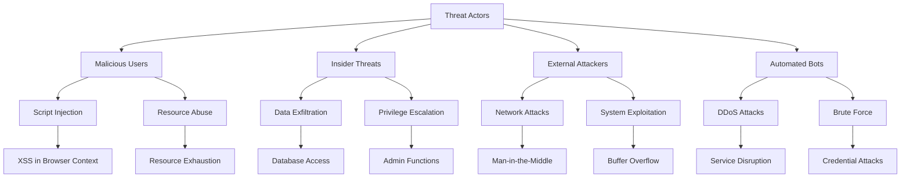

# Phân Tích Bảo Mật Chi Tiết

Tài liệu này cung cấp phân tích toàn diện về các khía cạnh bảo mật của BrowserAutomationStudio, bao gồm threat modeling, vulnerability assessment và security controls.

## 📋 Mục Lục

- [Threat Model](#threat-model)
- [Attack Surface Analysis](#attack-surface-analysis)
- [Input Validation & Sanitization](#input-validation--sanitization)
- [Authentication & Authorization](#authentication--authorization)
- [Data Protection](#data-protection)
- [Network Security](#network-security)
- [Code Injection Prevention](#code-injection-prevention)

## 🎯 Threat Model

### Threat Actors và Attack Vectors



### Security Risk Assessment

#### High Risk Areas
1. **Script Execution Engine** - Arbitrary code execution
2. **Browser Integration** - Web-based attacks
3. **Resource Management** - Data access controls
4. **Module System** - Third-party code execution
5. **Network Communications** - Data in transit

#### Medium Risk Areas
1. **File System Access** - Local file operations
2. **Database Connections** - SQL injection risks
3. **Scheduler Service** - Privilege escalation
4. **Update Mechanism** - Supply chain attacks

#### Low Risk Areas
1. **UI Components** - Limited attack surface
2. **Logging System** - Information disclosure
3. **Configuration Files** - Local access required

## 🛡️ Attack Surface Analysis

### Script Execution Attack Surface

```cpp
class SecureScriptExecutor {
private:
    // Sandboxing configuration
    struct SandboxConfig {
        bool allowFileAccess = false;
        bool allowNetworkAccess = true;
        bool allowSystemCalls = false;
        QStringList allowedDomains;
        QStringList blockedFunctions;
        int maxExecutionTime = 30000; // 30 seconds
        size_t maxMemoryUsage = 100 * 1024 * 1024; // 100MB
    };
    
    SandboxConfig _sandboxConfig;
    QSet<QString> _dangerousFunctions;
    
public:
    SecureScriptExecutor() {
        InitializeDangerousFunctions();
        SetupSandbox();
    }
    
    ExecutionResult ExecuteScript(const QString& script, const ExecutionContext& context) {
        // Pre-execution security checks
        auto validationResult = ValidateScript(script);
        if (!validationResult.isValid) {
            return ExecutionResult::SecurityViolation(validationResult.errors);
        }
        
        // Setup execution sandbox
        auto sandbox = CreateSandbox(context);
        
        // Monitor execution
        ExecutionMonitor monitor(script, _sandboxConfig.maxExecutionTime, 
                               _sandboxConfig.maxMemoryUsage);
        
        try {
            // Execute in sandboxed environment
            auto result = sandbox->Execute(script);
            
            // Post-execution validation
            ValidateExecutionResult(result);
            
            return result;
            
        } catch (const SecurityException& e) {
            LogSecurityViolation(script, e.what());
            return ExecutionResult::SecurityViolation(e.what());
        } catch (const std::exception& e) {
            LogExecutionError(script, e.what());
            return ExecutionResult::Error(e.what());
        }
    }
    
private:
    void InitializeDangerousFunctions() {
        _dangerousFunctions = {
            "eval", "Function", "setTimeout", "setInterval",
            "document.write", "innerHTML", "outerHTML",
            "execScript", "msWriteProfilerMark",
            "webkitRequestFileSystem", "webkitResolveLocalFileSystemURL"
        };
    }
    
    ScriptValidationResult ValidateScript(const QString& script) {
        ScriptValidationResult result;
        
        // Check for dangerous function calls
        for (const auto& dangerousFunc : _dangerousFunctions) {
            QRegularExpression regex(QString("\\b%1\\s*\\(").arg(dangerousFunc),
                                   QRegularExpression::CaseInsensitiveOption);
            if (regex.match(script).hasMatch()) {
                result.errors.append(QString("Dangerous function detected: %1").arg(dangerousFunc));
            }
        }
        
        // Check for suspicious patterns
        CheckSuspiciousPatterns(script, result);
        
        // Validate syntax
        if (!ValidateJavaScriptSyntax(script)) {
            result.errors.append("Invalid JavaScript syntax");
        }
        
        result.isValid = result.errors.isEmpty();
        return result;
    }
    
    void CheckSuspiciousPatterns(const QString& script, ScriptValidationResult& result) {
        QStringList suspiciousPatterns = {
            R"(document\.cookie)",                    // Cookie access
            R"(window\.location\.href\s*=)",         // Redirection
            R"(XMLHttpRequest|fetch\s*\()",          // Network requests
            R"(localStorage|sessionStorage)",         // Storage access
            R"(navigator\.)",                        // Browser fingerprinting
            R"(window\.open\s*\()",                  // Popup windows
            R"(alert\s*\(|confirm\s*\(|prompt\s*\()", // User interaction
            R"(btoa\s*\(|atob\s*\()",               // Base64 encoding/decoding
        };
        
        for (const auto& pattern : suspiciousPatterns) {
            QRegularExpression regex(pattern, QRegularExpression::CaseInsensitiveOption);
            auto matches = regex.globalMatch(script);
            while (matches.hasNext()) {
                auto match = matches.next();
                result.warnings.append(QString("Suspicious pattern detected: %1 at position %2")
                                     .arg(match.captured(0))
                                     .arg(match.capturedStart()));
            }
        }
    }
};
```

### Browser Security Controls

```cpp
class SecureBrowserManager {
private:
    struct SecurityPolicy {
        bool blockMixedContent = true;
        bool enforceCSP = true;
        bool blockDangerousDownloads = true;
        bool disablePlugins = true;
        QStringList allowedSchemes = {"https", "data", "blob"};
        QStringList blockedDomains;
        int maxRedirects = 5;
    };
    
    SecurityPolicy _securityPolicy;
    QHash<int, BrowserSecurityContext> _browserContexts;
    
public:
    CefRefPtr<CefBrowser> CreateSecureBrowser(const BrowserConfig& config) {
        // Create security context
        BrowserSecurityContext securityContext;
        securityContext.sessionId = GenerateSecureSessionId();
        securityContext.creationTime = QDateTime::currentDateTime();
        securityContext.allowedOrigins = config.allowedOrigins;
        
        // Configure CEF settings for security
        CefBrowserSettings settings;
        ApplySecuritySettings(settings);
        
        // Create browser with security handler
        auto securityHandler = new SecureBrowserHandler(securityContext);
        
        CefWindowInfo windowInfo;
        windowInfo.SetAsWindowless(nullptr);
        
        auto browser = CefBrowserHost::CreateBrowserSync(
            windowInfo, securityHandler, config.url, settings, nullptr, nullptr);
        
        if (browser) {
            _browserContexts.insert(browser->GetIdentifier(), securityContext);
            
            // Apply additional security measures
            ApplyRuntimeSecurityMeasures(browser);
        }
        
        return browser;
    }
    
private:
    void ApplySecuritySettings(CefBrowserSettings& settings) {
        // Disable dangerous features
        settings.plugins = STATE_DISABLED;
        settings.java = STATE_DISABLED;
        settings.application_cache = STATE_DISABLED;
        settings.databases = STATE_DISABLED;
        settings.webgl = STATE_DISABLED;
        settings.javascript_close_windows = STATE_DISABLED;
        settings.javascript_access_clipboard = STATE_DISABLED;
        
        // Enable security features
        settings.web_security = STATE_ENABLED;
        settings.file_access_from_file_urls = STATE_DISABLED;
        settings.universal_access_from_file_urls = STATE_DISABLED;
        
        // Set secure defaults
        settings.default_encoding = "utf-8";
        settings.background_color = 0x00FFFFFF;
    }
    
    void ApplyRuntimeSecurityMeasures(CefRefPtr<CefBrowser> browser) {
        // Inject Content Security Policy
        QString cspScript = R"(
            var meta = document.createElement('meta');
            meta.httpEquiv = 'Content-Security-Policy';
            meta.content = "default-src 'self'; script-src 'self' 'unsafe-inline'; style-src 'self' 'unsafe-inline'; img-src 'self' data: https:; connect-src 'self' https:; font-src 'self' data:; object-src 'none'; media-src 'self'; frame-src 'none';";
            document.head.appendChild(meta);
        )";
        
        browser->GetMainFrame()->ExecuteJavaScript(cspScript.toStdString(), "", 0);
        
        // Disable dangerous APIs
        QString securityScript = R"(
            // Override dangerous functions
            window.eval = function() { throw new Error('eval() is disabled for security'); };
            window.Function = function() { throw new Error('Function() constructor is disabled'); };
            
            // Limit setTimeout/setInterval
            var originalSetTimeout = window.setTimeout;
            var originalSetInterval = window.setInterval;
            
            window.setTimeout = function(func, delay) {
                if (typeof func === 'string') {
                    throw new Error('String-based setTimeout is disabled');
                }
                return originalSetTimeout.call(this, func, Math.min(delay, 30000));
            };
            
            window.setInterval = function(func, delay) {
                if (typeof func === 'string') {
                    throw new Error('String-based setInterval is disabled');
                }
                return originalSetInterval.call(this, func, Math.max(delay, 100));
            };
            
            // Protect against prototype pollution
            Object.freeze(Object.prototype);
            Object.freeze(Array.prototype);
            Object.freeze(Function.prototype);
        )";
        
        browser->GetMainFrame()->ExecuteJavaScript(securityScript.toStdString(), "", 0);
    }
};
```

## 🔐 Input Validation & Sanitization

### Comprehensive Input Validation Framework

```cpp
class InputValidator {
public:
    enum class ValidationLevel {
        Strict,    // Maximum security, minimal functionality
        Balanced,  // Good security with reasonable functionality
        Permissive // Minimal security, maximum functionality
    };
    
private:
    ValidationLevel _level;
    QHash<QString, QRegularExpression> _patterns;
    QSet<QString> _allowedTags;
    QSet<QString> _allowedAttributes;
    
public:
    InputValidator(ValidationLevel level = ValidationLevel::Balanced) : _level(level) {
        InitializePatterns();
        InitializeAllowedElements();
    }
    
    ValidationResult ValidateUserInput(const QString& input, InputType type) {
        ValidationResult result;
        
        switch (type) {
        case InputType::ScriptCode:
            result = ValidateScriptCode(input);
            break;
        case InputType::URL:
            result = ValidateURL(input);
            break;
        case InputType::Selector:
            result = ValidateSelector(input);
            break;
        case InputType::ResourceName:
            result = ValidateResourceName(input);
            break;
        case InputType::FileName:
            result = ValidateFileName(input);
            break;
        case InputType::DatabaseQuery:
            result = ValidateDatabaseQuery(input);
            break;
        }
        
        // Apply additional security checks based on validation level
        if (result.isValid && _level == ValidationLevel::Strict) {
            result = ApplyStrictValidation(input, type, result);
        }
        
        return result;
    }
    
private:
    void InitializePatterns() {
        // URL validation pattern
        _patterns["url"] = QRegularExpression(
            R"(^https?:\/\/(www\.)?[-a-zA-Z0-9@:%._\+~#=]{1,256}\.[a-zA-Z0-9()]{1,6}\b([-a-zA-Z0-9()@:%_\+.~#?&//=]*)$)");
        
        // CSS selector pattern
        _patterns["selector"] = QRegularExpression(
            R"(^[a-zA-Z0-9\s\.\#\[\]\:\(\)\-_,>+~*="']+$)");
        
        // Resource name pattern
        _patterns["resource_name"] = QRegularExpression(
            R"(^[a-zA-Z][a-zA-Z0-9_]{0,63}$)");
        
        // File name pattern (no path traversal)
        _patterns["filename"] = QRegularExpression(
            R"(^[a-zA-Z0-9][a-zA-Z0-9\.\-_]{0,254}$)");
        
        // SQL injection detection patterns
        _patterns["sql_injection"] = QRegularExpression(
            R"((union|select|insert|update|delete|drop|create|alter|exec|execute)\s)",
            QRegularExpression::CaseInsensitiveOption);
    }
    
    ValidationResult ValidateScriptCode(const QString& script) {
        ValidationResult result;
        
        // Check for script injection patterns
        QStringList injectionPatterns = {
            R"(<script[^>]*>)",
            R"(javascript:)",
            R"(vbscript:)",
            R"(onload\s*=)",
            R"(onerror\s*=)",
            R"(onclick\s*=)",
            R"(eval\s*\()",
            R"(Function\s*\()",
            R"(setTimeout\s*\(.*string)",
            R"(setInterval\s*\(.*string)"
        };
        
        for (const auto& pattern : injectionPatterns) {
            QRegularExpression regex(pattern, QRegularExpression::CaseInsensitiveOption);
            if (regex.match(script).hasMatch()) {
                result.errors.append(QString("Potential script injection detected: %1").arg(pattern));
            }
        }
        
        // Check for suspicious Unicode characters
        if (ContainsSuspiciousUnicode(script)) {
            result.warnings.append("Script contains suspicious Unicode characters");
        }
        
        // Validate script length
        if (script.length() > 1000000) { // 1MB limit
            result.errors.append("Script exceeds maximum allowed length");
        }
        
        result.isValid = result.errors.isEmpty();
        return result;
    }
    
    ValidationResult ValidateURL(const QString& url) {
        ValidationResult result;
        
        // Basic format validation
        if (!_patterns["url"].match(url).hasMatch()) {
            result.errors.append("Invalid URL format");
            result.isValid = false;
            return result;
        }
        
        QUrl qurl(url);
        
        // Check scheme
        if (!qurl.scheme().startsWith("http")) {
            result.errors.append("Only HTTP/HTTPS URLs are allowed");
        }
        
        // Check for suspicious domains
        if (IsSuspiciousDomain(qurl.host())) {
            result.warnings.append("URL points to potentially suspicious domain");
        }
        
        // Check for URL shorteners (potential security risk)
        QStringList urlShorteners = {
            "bit.ly", "tinyurl.com", "t.co", "goo.gl", "ow.ly", "short.link"
        };
        
        if (urlShorteners.contains(qurl.host())) {
            result.warnings.append("URL uses URL shortener service");
        }
        
        result.isValid = result.errors.isEmpty();
        return result;
    }
    
    ValidationResult ValidateDatabaseQuery(const QString& query) {
        ValidationResult result;
        
        // Check for SQL injection patterns
        if (_patterns["sql_injection"].match(query).hasMatch()) {
            result.errors.append("Potential SQL injection detected");
        }
        
        // Check for dangerous SQL commands
        QStringList dangerousCommands = {
            "drop", "truncate", "delete", "update", "insert", 
            "create", "alter", "grant", "revoke", "exec", "execute"
        };
        
        QString lowerQuery = query.toLower();
        for (const auto& command : dangerousCommands) {
            if (lowerQuery.contains(command)) {
                if (_level == ValidationLevel::Strict) {
                    result.errors.append(QString("Dangerous SQL command detected: %1").arg(command));
                } else {
                    result.warnings.append(QString("SQL command requires review: %1").arg(command));
                }
            }
        }
        
        // Check for comment-based injection
        if (query.contains("--") || query.contains("/*") || query.contains("*/")) {
            result.warnings.append("SQL query contains comments");
        }
        
        result.isValid = result.errors.isEmpty();
        return result;
    }
    
    bool ContainsSuspiciousUnicode(const QString& text) {
        // Check for homograph attacks and suspicious Unicode
        for (const QChar& ch : text) {
            uint unicode = ch.unicode();
            
            // Check for suspicious Unicode ranges
            if ((unicode >= 0x2000 && unicode <= 0x206F) ||  // General Punctuation
                (unicode >= 0xFE00 && unicode <= 0xFE0F) ||  // Variation Selectors
                (unicode >= 0xFFF0 && unicode <= 0xFFFF)) {  // Specials
                return true;
            }
        }
        return false;
    }
    
    bool IsSuspiciousDomain(const QString& domain) {
        // Check against known malicious domain patterns
        QStringList suspiciousPatterns = {
            R"(\d+\.\d+\.\d+\.\d+)",  // IP addresses
            R"(.*\.tk$)",              // Free TLD
            R"(.*\.ml$)",              // Free TLD
            R"(.*\.ga$)",              // Free TLD
            R"(.*\.cf$)",              // Free TLD
        };
        
        for (const auto& pattern : suspiciousPatterns) {
            QRegularExpression regex(pattern);
            if (regex.match(domain).hasMatch()) {
                return true;
            }
        }
        
        return false;
    }
};
```

## 🔑 Authentication & Authorization

### Role-Based Access Control (RBAC)

```cpp
class SecurityManager {
public:
    enum class Permission {
        // Script permissions
        ExecuteScript,
        ModifyScript,
        DeleteScript,
        
        // Resource permissions
        AccessResources,
        ModifyResources,
        CreateResources,
        
        // System permissions
        AccessFileSystem,
        AccessNetwork,
        AccessDatabase,
        ModifySettings,
        
        // Administrative permissions
        ManageUsers,
        ViewLogs,
        ManageModules,
        SystemAdministration
    };
    
    enum class Role {
        Guest,          // Read-only access
        User,           // Basic automation capabilities
        PowerUser,      // Advanced features
        Administrator   // Full system access
    };
    
private:
    struct UserContext {
        QString userId;
        Role role;
        QSet<Permission> customPermissions;
        QDateTime sessionStart;
        QDateTime lastActivity;
        QString sessionToken;
        bool isActive;
    };
    
    QHash<QString, UserContext> _userSessions;
    QHash<Role, QSet<Permission>> _rolePermissions;
    QMutex _securityMutex;
    
public:
    SecurityManager() {
        InitializeRolePermissions();
    }
    
    QString AuthenticateUser(const QString& username, const QString& password) {
        QMutexLocker locker(&_securityMutex);
        
        // Validate credentials (implement your authentication logic)
        if (!ValidateCredentials(username, password)) {
            LogSecurityEvent("Authentication failed", username);
            return QString();
        }
        
        // Create session
        UserContext context;
        context.userId = username;
        context.role = GetUserRole(username);
        context.sessionStart = QDateTime::currentDateTime();
        context.lastActivity = context.sessionStart;
        context.sessionToken = GenerateSecureToken();
        context.isActive = true;
        
        _userSessions.insert(context.sessionToken, context);
        
        LogSecurityEvent("User authenticated", username);
        return context.sessionToken;
    }
    
    bool HasPermission(const QString& sessionToken, Permission permission) {
        QMutexLocker locker(&_securityMutex);
        
        auto it = _userSessions.find(sessionToken);
        if (it == _userSessions.end()) {
            return false;
        }
        
        UserContext& context = it.value();
        
        // Check session validity
        if (!IsSessionValid(context)) {
            _userSessions.remove(sessionToken);
            return false;
        }
        
        // Update last activity
        context.lastActivity = QDateTime::currentDateTime();
        
        // Check custom permissions first
        if (context.customPermissions.contains(permission)) {
            return true;
        }
        
        // Check role-based permissions
        auto rolePermissions = _rolePermissions.value(context.role);
        return rolePermissions.contains(permission);
    }
    
    bool AuthorizeOperation(const QString& sessionToken, const QString& operation, 
                          const QJsonObject& context = QJsonObject()) {
        if (!HasPermission(sessionToken, GetRequiredPermission(operation))) {
            LogSecurityEvent("Unauthorized operation attempt", 
                           QString("Operation: %1, Token: %2").arg(operation, sessionToken));
            return false;
        }
        
        // Additional context-based authorization
        return AuthorizeWithContext(sessionToken, operation, context);
    }
    
private:
    void InitializeRolePermissions() {
        // Guest role - minimal permissions
        _rolePermissions[Role::Guest] = {
            Permission::ExecuteScript  // Read-only script execution
        };
        
        // User role - basic automation
        _rolePermissions[Role::User] = {
            Permission::ExecuteScript,
            Permission::ModifyScript,
            Permission::AccessResources,
            Permission::AccessNetwork
        };
        
        // Power User role - advanced features
        _rolePermissions[Role::PowerUser] = {
            Permission::ExecuteScript,
            Permission::ModifyScript,
            Permission::DeleteScript,
            Permission::AccessResources,
            Permission::ModifyResources,
            Permission::CreateResources,
            Permission::AccessFileSystem,
            Permission::AccessNetwork,
            Permission::AccessDatabase
        };
        
        // Administrator role - full access
        _rolePermissions[Role::Administrator] = {
            Permission::ExecuteScript,
            Permission::ModifyScript,
            Permission::DeleteScript,
            Permission::AccessResources,
            Permission::ModifyResources,
            Permission::CreateResources,
            Permission::AccessFileSystem,
            Permission::AccessNetwork,
            Permission::AccessDatabase,
            Permission::ModifySettings,
            Permission::ManageUsers,
            Permission::ViewLogs,
            Permission::ManageModules,
            Permission::SystemAdministration
        };
    }
    
    bool IsSessionValid(const UserContext& context) {
        // Check if session is active
        if (!context.isActive) {
            return false;
        }
        
        // Check session timeout (30 minutes of inactivity)
        qint64 inactiveTime = context.lastActivity.msecsTo(QDateTime::currentDateTime());
        if (inactiveTime > 30 * 60 * 1000) {
            return false;
        }
        
        // Check maximum session duration (8 hours)
        qint64 sessionDuration = context.sessionStart.msecsTo(QDateTime::currentDateTime());
        if (sessionDuration > 8 * 60 * 60 * 1000) {
            return false;
        }
        
        return true;
    }
    
    Permission GetRequiredPermission(const QString& operation) {
        static QHash<QString, Permission> operationPermissions = {
            {"execute_script", Permission::ExecuteScript},
            {"modify_script", Permission::ModifyScript},
            {"delete_script", Permission::DeleteScript},
            {"access_resource", Permission::AccessResources},
            {"modify_resource", Permission::ModifyResources},
            {"create_resource", Permission::CreateResources},
            {"file_operation", Permission::AccessFileSystem},
            {"network_request", Permission::AccessNetwork},
            {"database_query", Permission::AccessDatabase},
            {"modify_settings", Permission::ModifySettings},
            {"manage_users", Permission::ManageUsers},
            {"view_logs", Permission::ViewLogs},
            {"manage_modules", Permission::ManageModules},
            {"system_admin", Permission::SystemAdministration}
        };
        
        return operationPermissions.value(operation, Permission::SystemAdministration);
    }
    
    QString GenerateSecureToken() {
        // Generate cryptographically secure random token
        QByteArray randomData(32, 0);
        QRandomGenerator::securelySeeded().fillRange(
            reinterpret_cast<quint32*>(randomData.data()), 
            randomData.size() / sizeof(quint32));
        
        return QCryptographicHash::hash(randomData, QCryptographicHash::Sha256).toHex();
    }
    
    void LogSecurityEvent(const QString& event, const QString& details) {
        QJsonObject logEntry;
        logEntry["timestamp"] = QDateTime::currentDateTime().toString(Qt::ISODate);
        logEntry["event"] = event;
        logEntry["details"] = details;
        logEntry["source"] = "SecurityManager";
        
        // Write to security log
        WriteSecurityLog(logEntry);
    }
};
```

---

*Tài liệu này tiếp tục với các phần về data protection, network security và code injection prevention.*
